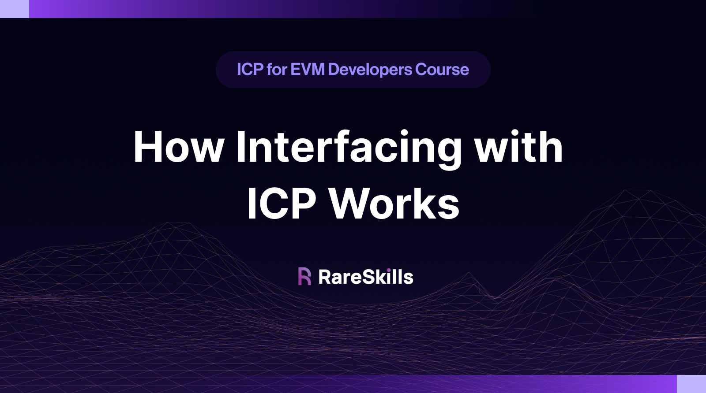

# How Interfacing with ICP Works



In Ethereum, developers use RPC providers like Infura or full nodes to handle transaction broadcasting and interaction with the network. On the Internet Computer (ICP), **Boundary Nodes** serve a similar function; they act as intermediaries that facilitate communication between external users and the ICP network.

## Boundary Nodes: The Access Point to ICP

Boundary Nodes, managed by the [DFINITY Foundation](https://dfinity.org/), handle routing calls to the correct subnet, load balancing traffic across replicas, and ensuring secure communication with canisters.

ICP can be accessed in two ways: through **API Boundary Nodes** or **HTTP Gateways**.

### The Role of HTTP Gateways

The **HTTP Gateway** allows standard web browsers to interact with decentralized applications (dApps) running on ICP. It converts HTTP requests into canister calls on the Internet Computer.

The **`ic-gateway`** (formerly known as **`icx-proxy`**) is responsible for managing these requests. It translates incoming HTTP requests into IC-native canister calls. Once the canister processes the request, `ic-gateway` maps the response back into a standard HTTP response format. The **ic-gateway** operates in two modes:

* `<canister_id>.ic0.app`: Authenticates the response certificate before forwarding it to the client.
* `<canister_id>.raw.ic0.app`: Permissively enforces response verification (Only checks certificate if its present).

In our [first token transaction tutorial](https://www.notion.so/ICP-Token-Transfer-and-Verification-using-Agent-js-16dd85561f084591806e8c86cf7bc334?pvs=21), the `transact()` function call was routed through a Boundary Node, directed to the ICP Ledger Canister for execution. Specifically, it leveraged the **HTTP Gateway** method to process the function call.

```rust
// Create an HTTP agent with the identity
const agent = await HttpAgent.create({ identity });
```

By default, the `agent` points to the standard `ic0.app` domain.

HTTP Gateways can also filter content to comply with local legal frameworks (e.g., gambling services in a country). To learn more about content filtering, see [Content Filtering via The Boundary Nodes](https://wiki.internetcomputer.org/wiki/Content_Filtering_via_Boundary_Nodes).

In the future, as part of the [solenoid milestone](https://internetcomputer.org/roadmap#Platform%20Decentralization-Solenoid), HTTP Gateways will evolve into **standalone components**. This means anyone, not just the NNS, can host an HTTP Gateway, enhancing the decentralization of ICP’s edge infrastructure.

### API Boundary Nodes for Direct Canister Access

In the new boundary-node architecture, **API Boundary Nodes** are placed under the full control of the **NNS**. API canister calls are routed through boundary nodes at the `icp-api.io/api/v2` endpoint.

Their core service, the `ic-boundary` API, forwards requests directly to the appropriate canister, bypassing the HTTP Gateway's translation layer. As no translation is required, `query calls`, `update calls`, and `read_state` calls are faster.

As previously mentioned, HTTP Gateways translate HTTP requests and translates them to API canister calls, which are then sent to the API Boundary Nodes. The image below depicts the overall architecture of the IC Boundary Nodes.


In the future, `ic-boundary` is in works to perform caching. To perform API Canister Calls learn [here](https://internetcomputer.org/docs/current/references/ic-interface-spec/#http-interface).

## The Boundary Nodes are Currently Being Upgraded

To monitor their progress and milestones, visit the links below:

* [Solenoid Milestone](https://internetcomputer.org/roadmap#Platform%20Decentralization-Solenoid)
* [Future of Boundary Nodes Forum](https://forum.dfinity.org/t/boundary-node-roadmap/15562/60)
