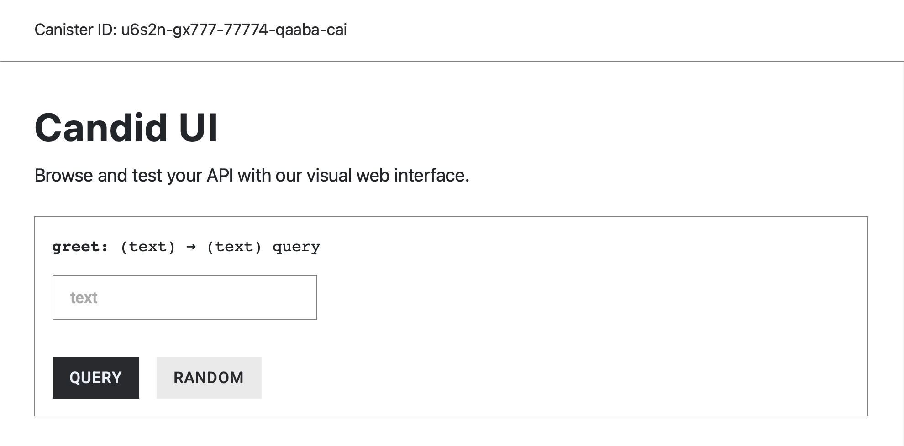
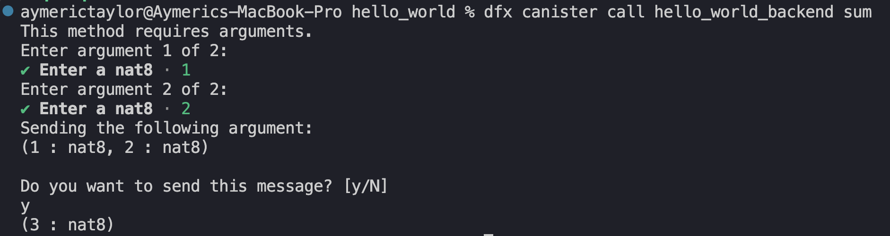

# Function Visibility and Mutability

In Rust canisters, **attribute macros** are used to specify a function’s visibility and state-mutability.

Attribute macros are annotations written in the form `#[attribute_name]` (e.g., `#[ic_cdk::query]`). They modify or extend the behavior of items such as functions by adding metadata or triggering code generation during compilation.

Consider the boilerplate function `greet()` from the previous `hello_world` canister:

```rust
#[ic_cdk::query]
fn greet(name: String) -> String {
		format!("Hello, {}!", name)
}
```

`greet()` is a publicly callable function that you can invoke from the Candid UI, `dfx` CLI, or by other canisters.

What makes the `greet()` function public is the `#[ic_cdk::query]` annotation:


`#[ic_cdk::query]`, specifically makes a canister function’s visibility **public**, and it also modifies the function’s state-mutability, which is elaborated in the next section.

## Update and Query Attribute Macros

There two attribute macros that defines a canister function’s visibility **and** state-mutability:

1.  `#[ic_cdk::query]`. It defines a **public** function with **state-viewing** access. Query functions can perform computations and view the canister’s state (like `public view` in Solidity).

    ```rust
    #[ic_cdk::query]
    fn query_function() {

    		// Computations
    		// View State
    		
    }
    ```
2.  `#[ic_cdk::update]`. It defines a **public** function with **state-changing** access. Update functions can perform computations and modify the canister’s state (similar to a non-view `public` function in Solidity).

    ```rust
    #[ic_cdk::update]
    fn update_function() {

    		// Computations
    		// View State
    		// Modify State
    		
    }
    ```

These attribute macros are provided by the [Rust `ic_cdk` crate](https://docs.rs/ic-cdk/latest/ic_cdk/) (Internet Computer Canister Development Kit), which is the software development kit for developing canister in Rust.

### Internal Functions (No Attribute Macros)

Functions without attribute macros remain **internal**, only callable from by other functions within the same canister. This is similar to declaring an `internal` function in Solidity.

```rust
fn internal_function {
		// Perform computation
		// View State
		// Modify State
		// Only callable from within the same canister
}
```

### Other Solidity Function Specifier Equivalents

Solidity function specifiers such as `external`, `private`, and `pure` **do not** have an equivalent in ICP. Rust canisters also do not support inheritance, so `virtual` and `override` don’t apply either. Special cases like a `constructor` and `payable` are handled differently and will be covered later.

In the next section we’ll create introduce a new function to our hello\_world canister and test it out on the local IC instance.

## Sum of Two

The canister function, `sum()`, below takes two `u8` integer arguments and returns their sum.

```rust
fn sum(a: u8, b: u8) -> u8 {
		let total = a + b;
    return total;
}
```

`sum()` above is an **internal** function that can only be called from within the canister because it doesn't have any attribute macro.

To make `sum()` externally callable, add the query attribute macro — `#[ic_cdk::query]` — above the function.

```rust
#[ic_cdk::query] // query attribute macro added
fn sum(a: u8, b: u8) -> u8 {
    return a + b;
} 
```

Because the query attribute macro is used, `sum()` is constrained to viewing the canister’s state. Query functions cannot modify the canister’s state. If the update attribute macro was used instead, `sum()` would also have state-changing permission.

Let’s deploy a canister with the `sum()` and pass arguments to it using **dfx CLI** or the **Candid UI**.

### New canister function `sum()`

Within the `hello_world` canister, insert `sum()` like so:

```rust
#[ic_cdk::query]
fn greet(name: String) -> String {
    format!("Hello, {}!", name)
}

// New canister function
#[ic_cdk::query]
fn sum(a: u8, b: u8) -> u8 {
    return a + b;
} 
```

Make sure that there is a running local IC instance. Use the command `dfx start` in a new terminal.

```
dfx start
```

Deploy the `hello_world` canister using the `dfx deploy` command.

```rust
dfx deploy
```

After the canister is deployed open the candid interface using the link provided in the terminal. You would notice that `sum()` is **absent** from the Candid UI:



And `sum()` **fails** to be called from the dfx CLI:

```bash
dfx canister call hello_world_backend sum
```

You’ll get the following error message:


The issues above occur because the interface for newly added functions are not automatically generated when we deploy a canister in `dfx`. Therefore, `dfx CLI` and `Candid UI` cannot give you an simple UI and UX for interfacing with it.

To fix this, we would need to tell dfx that `hello_world` canister has a query function called `sum()`, and specify how to interface with it. This is done through the **Candid Interface** file, which is analogous to the ABI Interface in Solidity.

## The Candid Interface File In dfx

Just as the ABI interface defines how to interact with Ethereum contract functions, the Candid Interface defines how one can interact with ICP canister functions. \*\*\*\*

Inside your project directory, the Candid interface for the `hello_world` canister is located in the `src/hello_world_backend/hello_world_backend.did` file. Navigate to this file to view or edit the interface.

```bash
hello_world/
├── src/
│   └── hello_world_backend/
│       └── **hello_world_backend.did**
```

Currently, `hello_world_backend.did` only contains the interface for the boilerplate `greet()` function. It is missing `sum()`’s candid interface.

```bash
service : {
    "greet": (text) -> (text) query;
}
```

We’ll need to add `sum()`’s interface so that `dfx` knows that:

1. The `hello_world` canister has a function called `sum()`.
2. How to call `sum()`—including how to encode the arguments and decode the response.

`~~dfx` does not automatically update the Candid Interface file for Rust canisters. Therefore, we need to manually register `sum()`'s Candid Interface at the `hello_world_backend.did` file.\~\~

### How To Generate The Candid Interface For Rust Canisters

To generate the correct `.did` file with the `sum()` function, we first need to insert the `ic_cdk::export_candid!();` macro at the end of the `lib.rs` file\*\*.\*\*

```rust
#[ic_cdk::query]
fn sum(a: u8, b: u8) -> u8 {
    return a + b;
}

#[ic_cdk::query]
fn greet(name: String) -> String {
    format!("Hello, {}!", name)
}

// Enable Candid export
ic_cdk::export_candid!();
```

Next, install the following tools:

* `candid-extractor`, a library that automatically generates the candid interface for Rust canister functions.
* `generate-did`, a tool that automates the `.did` file generation.

```bash
cargo install candid-extractor
cargo install generate-did
```

Once the tools above are installed, we can run the command below to generate the correct `.did` file.

```bash
generate-did <canister_name>
```

The canister’s name is simply the “`project_name`” + “`_backend`". In our case it's `hello_world_backend`.

Run the command below after installing the tools to generate to generate `sum()`’s candid interface.

```bash
generate-did hello_world_backend
```


Open `hello_world_backend.did` again, it should now include `sum()`.

```bash
service : { 
	greet: (text) -> (text) query;
	sum : (nat8, nat8) -> (nat8) query;
}
```

For now, we’ll ignore what `nat8` or `text` is. These data types are specific to ICP’s Candid Interface Description Language.

Deploy the canister again. `sum()` is now callable through the **Candid UI** and **dfx CLI**:




The `candid-extractor` and `generate-did` tool only needs to be installed once. After that, you can use `generate-did <canister_name>` for any other future Rust canister projects as long as you have `ic_cdk::export_candid!()` declared in `lib.rs`.

### Wrapping Up

To summarize, canister functions are either:

* public with state-view permission: `#[ic_cdk::query]`.
* public with state-changing permission: `#[ic_cdk::update]`.
* or internal (no attribute macros).

Also, anytime we make changes to the canister’s functions, we’ll need to run `generate-did <Canister-name>` to update the Candid Interface file.

Query functions and internal functions have been covered in this tutorial. We’ll discusses state changing functions — functions annotated with `#[ic_cdk::update]`— along with state variables in the next article.
