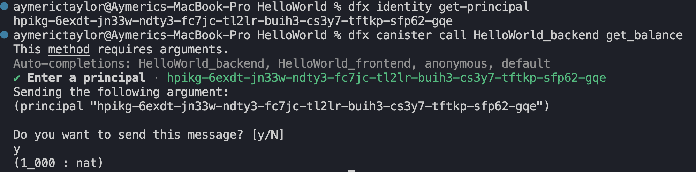
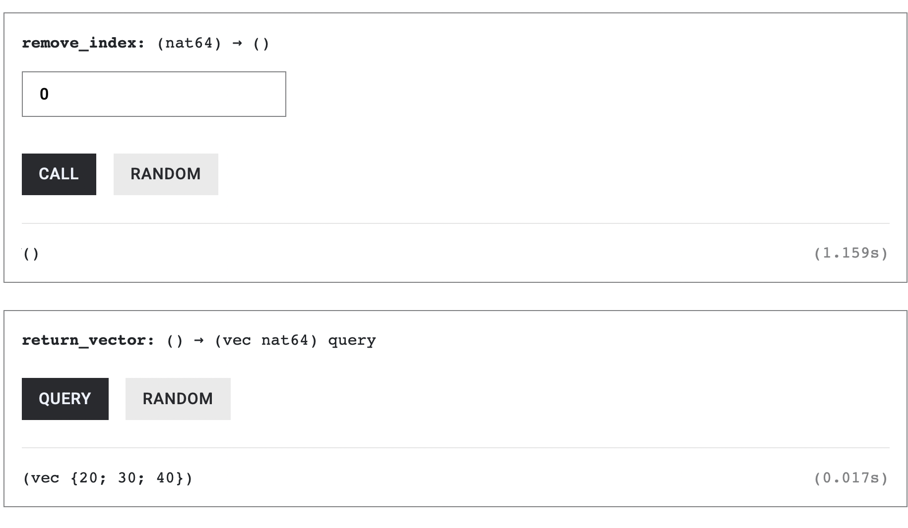
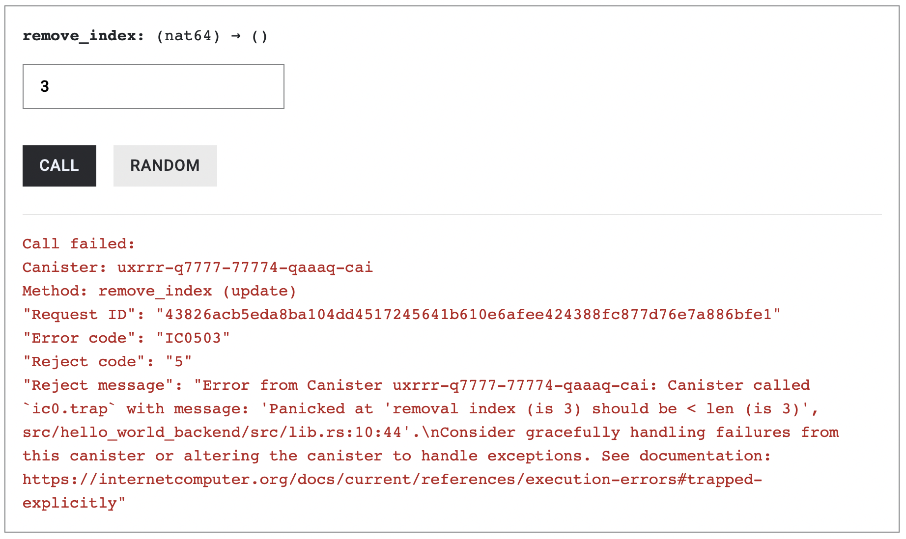
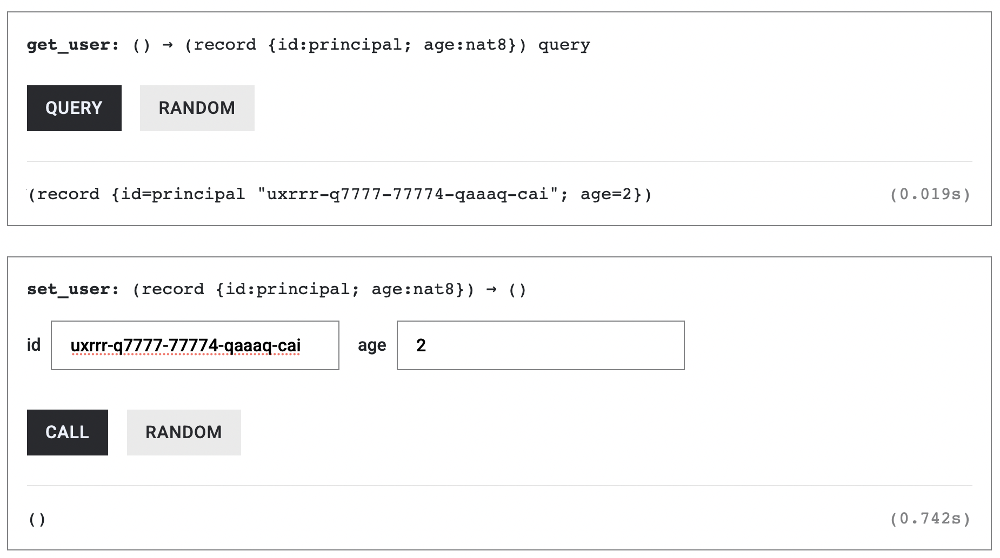

# Composite Types

So far in this series, we've used simple data types such as `u64`, `u128` and `bool`. These simple types hold a single value. In contrast, composite types are **data structures** built by combining other types, so a single value can contain multiple pieces of data. In this article, we’ll discuss commonly used composite types on ICP, which include:

| ICP / Rust type | Solidity equivalent   |
| --------------- | --------------------- |
| `Principal`     | `address`             |
| `Vec<T>`        | `T[]` (dynamic array) |
| `HashMap<K, V>` | `mapping(K => V)`     |
| `struct`        | `struct`              |

To follow along the code examples, create a new Rust canister project called `composite_types`:

```
dfx new composite_types --type rust --no-frontend
```

## The Principal Type (address)

`Principal` is the type used to identify both users (wallets) and canisters(smart contracts) on the Internet Computer.

* Example of a Wallet Principal: `hpikg-6exdt-jn33w-ndty3-fc7jc-tl2lr-buih3-cs3y7-tftkp-sfp62-gqe`
* Example of a Canister Principal: `uqqxf-5h777-77774-qaaaa-cai`

Since `Principal` is not a built-in Rust type, **it must be imported from the candid crate**, which defines ICP’s core data types.

```rust
use candid::Principal;
```

In `lib.rs`, add a thread-local static variable named `FOO` and set its type to `RefCell<Principal>`. Initialize it with `Principal::anonymous()`, which represents the anonymous principal (`2vxsx-fae`):

```rust
use candid::Principal;
use std::cell::RefCell;

thread_local! {
static FOO: RefCell<Principal> = RefCell::new(Principal::anonymous());
}
```

This initialization is intentional. On the Internet Computer, calls that are not authenticated execute under the anonymous principal.

**The ICP blockchain accepts unsigned transactions as valid state-changing transactions.** The reason for this design will be explained in the _Reverse Gas Model_ article later in this series. When a call is unsigned, it runs as the anonymous principal (2vxsx-fae), which effectively serves as the caller’s address. Since ICP does not have a zero address like Ethereum, the anonymous principal is commonly used as a conceptual equivalent.

### Reading a `Principal` Variable

Add a query function `get_foo()` that reads the `FOO` variable and returns a Principal.

```rust
use candid::Principal;
use std::cell::RefCell;

thread_local! {
    static FOO: RefCell<Principal> = RefCell::new(Principal::anonymous());
}

// new code here
#[ic_cdk::query]
fn get_foo() -> Principal {
    FOO.with_borrow(|cell| cell.clone())
}

ic_cdk::export_candid!();
```

Deploy the canister above and query `get_foo()`, it should return the anonymous principal: `2vxsx-fae` .


Notice that we used `.clone()` to access `FOO` instead of the `*` dereference operator.

```rust
FOO.with_borrow(|cell| cell.clone()) // ✅
```

### Why we use `.clone()` instead of the dereference operator ?

In Rust, `Principal` is a non-copy type. This means its value cannot be implicitly duplicated.

Using the dereference operator (`*`) would attempt to move the value out of the `RefCell`, which is not allowed when only a shared borrow is available. To return the value without transferring ownership, we explicitly call `.clone()`, which creates a new copy of the `Principal`.

### Writing to a `Principal` Variable

Let’s add a function `foo_as_last_caller()` to `lib.rs`, that retrieves the caller’s principal and stores it in `FOO`. We’ll use `msg_caller()` to get the function caller’s Principal (similar to `msg.sender` in Solidity). The `msg_caller()` method needs to be imported from the `ic_cdk::api` library. We’ll explain this more in-depth in the _System Information_ article.

```rust
use candid::Principal;
use ic_cdk::api::msg_caller;
use std::cell::RefCell;

thread_local! {
    static FOO: RefCell<Principal> = RefCell::new(Principal::anonymous());
}

// NEW CODE HERE
#[ic_cdk::update]
fn foo_as_last_caller() {
    FOO.with_borrow_mut(|cell| {
        *cell = msg_caller();
    });
}

#[ic_cdk::query]
fn get_foo() -> Principal {
    FOO.with_borrow(|cell| cell.clone())
}

ic_cdk::export_candid!();
```

Before we proceed and call the `foo_as_last_caller()` function, we need to run the `generate-did composite_types_backend` command. Running this command produces the following error:

```bash
**error[E0425]: cannot find function `msg_caller` in this scope**
  **-->** src/composite_types_backend/src/lib.rs:19:17
   **|**
**19** **|**         *cell = msg_caller();
   **|**                 **^^^^^^^^^^** **not found in this scope**
   **|**
**help**: consider importing this function
   **|**
 **1** + use ic_cdk::api::msg_caller;
```

This error occurs because `msg_caller()` is not part of Rust’s standard library and is not automatically in scope. It is provided by the `ic_cdk::api` module, so we must explicitly import it before using it.

To fix this, add the following import at the top of `lib.rs`:

```bash
use ic_cdk::api::msg_caller;
```

Function calls coming from the Candid UI are unauthenticated or unsigned, therefore calling `foo_as_last_caller()` will set `FOO` to the anonymous principal as shown below:


Try calling the `foo_as_last_caller` from the terminal by running the command below:

```rust
dfx canister call composite_types_backend foo_as_last_caller
```


Unlike calls made from the Candid UI, this command is authenticated with your local `dfx` identity. As a result, FOO is updated to store your developer identity’s principal.

Then call `get_foo()` from the terminal using the following command:

```bash
dfx canister call composite_types_backend get_foo 
```

\*\*\*\*In the output, you will notice that the principal stored in `FOO` differs from the anonymous principal (2vxsx-fae).


This is because dfx commands are authenticated with your developer identity.

To check the principal of your dfx identity, use the command below:

```rust
dfx identity get-principal
```

The value you obtain from `dfx identity get-principal` should match what `FOO` has stored.

## HashMaps

`HashMap`s in Rust work similarly to `mapping`s in Solidity. They associate a unique key with a corresponding value.

To use `HashMap`, we import it from the standard collections library (`std`):

```rust
use std::collections::HashMap;
```

**Note:** In your project directory, reset `lib.rs` to an empty file and paste in the code shown in the corresponding snippet.

**We’ll create a simple balance-tracking system where each principal (user or canister) has an associated balance.** To do this, declare a `HashMap` variable named `BALANCES` that maps a `Principal` to a `u128 balance` and initialize it with `HashMap::new()`.

```rust
use std::collections::HashMap;
use candid::Principal;
use std::cell::RefCell;

thread_local! {
    static BALANCES: RefCell<HashMap<Principal, u128>> = RefCell::new(HashMap::new());
}
```

In the next section, we will show you how to update and query a `HashMap`.

### Insert an entry to a HashMap

To update or insert entries to the `BALANCES` HashMap, we use the `.insert()` method. Since this operation updates the state, updating `BALANCES` uses `.with_borrow_mut()`.

The function `set_balance()` allows a principal to freely set their `BALANCES` amount.

```rust
use std::collections::HashMap;
use candid::Principal;
use std::cell::RefCell;

thread_local! {
    static BALANCES: RefCell<HashMap<Principal, u128>> = RefCell::new(HashMap::new());
}

#[ic_cdk::update]
fn set_balance(principal: Principal, amount: u128) {
    BALANCES.with_borrow_mut(|cell| {
        cell.insert(principal, amount);
    });
}

ic_cdk::export_candid!();
```

The `.insert()` either adds a new entry or replaces an existing one for the specified key, which in our case is the principal.

### Query an entry from a HashMap

To query the value associated with a particular `Principal`, we use `.get()` followed by `.unwrap_or(&0)`.

The `.get()` method returns an `Option`: it yields `Some(&value)` if the key exists, or `None` if it does not. By calling `.unwrap_or(&0)` on this result, we convert the `None` case into a default value of `0`, while returning the stored value when the entry is present.

```rust
use std::collections::HashMap;
use candid::Principal;
use std::cell::RefCell;

thread_local! {
    static BALANCES: RefCell<HashMap<Principal, u128>> = RefCell::new(HashMap::new());
}

#[ic_cdk::update]
fn set_balance(principal: Principal, amount: u128) {
    BALANCES.with_borrow_mut(|cell| {
        cell.insert(principal, amount);
    });
}

// new code here
#[ic_cdk::query]
fn get_balance(principal: Principal) -> u128 {
    BALANCES.with_borrow(|cell| *cell.get(&principal).unwrap_or(&0))
} 

ic_cdk::export_candid!();
```

Let's update `set_balance` so that callers can only modify their own balance and let `get_balance()` remain unchanged.

```rust
use std::collections::HashMap;
use candid::Principal;
use std::cell::RefCell;
use ic_cdk::api::msg_caller;

thread_local! {
    static BALANCES: RefCell<HashMap<Principal, u128>> = RefCell::new(HashMap::new());
}

#[ic_cdk::update]
fn set_balance(amount: u128) {
    BALANCES.with_borrow_mut(|cell| {
        cell.insert(msg_caller(), amount);
    });
}

#[ic_cdk::query]
fn get_balance(principal: Principal) -> u128 {
    BALANCES.with_borrow(|cell| *cell.get(&principal).unwrap_or(&0))
}

ic_cdk::export_candid!();
```

Generate the correct Candid Interface using `generate-did composite_types_backend`.

Call the `set_balance()` function using `dfx CLI` and give it a value of `1000`

```rust
dfx canister call composite_types_backend set_balance
```

It should yield a similar output to the image below. `BALANCES` should have a new entry that maps your **identity principal** to **1000**.


Verify your entry by querying `get_balance()` and passing the principal of the identity `dfx` is using (`dfx identity get-principal`). It should return `1000`.



## Vectors: Dynamic Arrays

Vectors are resizable arrays whose size can change as elements are added or removed. A vector has the type `Vec<T>`. You can initialize it as an empty vector with `vec![]`, or with values such as `vec![1, 2, 3, 4, 5]`.

A static `RefCell` variable of type `Vec<u64>` is declared below with two entries, `10`, `20`.

```rust
use std::cell::RefCell;

thread_local! {
    static U64_VECTOR: RefCell<Vec<u64>> = RefCell::new(vec![10,20]);
}
```

To return the contents of `U64_VECTOR`, use `.with_borrow()` and `.clone()`

```rust
use std::cell::RefCell;

thread_local! {
    static U64_VECTOR: RefCell<Vec<u64>> = RefCell::new(vec![10,20]);
}

#[ic_cdk::query]
fn return_vector() -> Vec<u64> {
    U64_VECTOR.with_borrow(|cell| cell.clone())
}

ic_cdk::export_candid!();
```

Deploy the canister above and call `return_vector()`, it will return the entire contents of the vector:


### Reading Vector elements

Accessing the elements of a `Vec<T>` is similar to Solidity arrays: use `[index]`.

```rust
use std::cell::RefCell;

thread_local! {
    static U64_VECTOR: RefCell<Vec<u64>> = RefCell::new(vec![10,20,30,40]);
}

#[ic_cdk::query]
fn vector_at_index_1() -> u64 {
    U64_VECTOR.with_borrow(|cell| cell[1])
}

ic_cdk::export_candid!();
```

Calling `vector_at_index_1()` returns `20`, the element at index 1 (the second element in the vector).


### Vector Index is of type `usize`

If you want to access a vector at a given index, make sure the index is of type `usize`:

```rust
use std::cell::RefCell;

thread_local! {
    static U64_VECTOR: RefCell<Vec<u64>> = RefCell::new(vec![10,20,30,40]);
}

#[ic_cdk::query]
fn vector_at_index(index: usize) -> u64 {
    U64_VECTOR.with_borrow(|cell| cell[index])
}

ic_cdk::export_candid!();
```

Call `vector_at_index(3)`, it should return the fourth element.


Querying outside of the vector’s index however will trigger a panic:


### Updating vector elements

To update the value of the vector at a specific index, we use `.with_borrow_mut()` to get a mutable reference to the vector, then update the element by writing `cell[index] = value` inside the closure.

```rust
use std::cell::RefCell;

thread_local! {
    static U64_VECTOR: RefCell<Vec<u64>> = RefCell::new(vec![10,20,30,40]);
}

// NEW CODE HERE
#[ic_cdk::update]
fn set_value(index: usize, value: u64){
		// write to the value
    U64_VECTOR.with_borrow_mut(|cell| {
        cell[index] = value;
    });
}

#[ic_cdk::query]
fn vector_at_index(index: usize) -> u64 {
    U64_VECTOR.with_borrow(|cell| cell[index])
}

ic_cdk::export_candid!();
```

Call `set_value(1, 99)`. Then call `vector_at_index(1)` to verify that the value has been updated.


If you pass an out of bounds index to `set_value`, the call will panic:


However, we can avoid this panic by using `vector.get(index)` instead of indexing with `vector[index]`.

The `.get` method returns an `Option<&u64>`:

* `Some(&value)` if the index is in bounds
* `None` if it is out of bounds

This way, even if we accidentally use an out-of-bounds index, the function won’t panic — it will simply return `None`.

We then call `.copied()` to convert `Option<&u64>` into `Option<u64>` so it matches the function’s return type:

```rust
// Safely read a value from the vector
#[ic_cdk::query]
fn vector_at_index(index: usize) -> Option<u64> {
    U64_VECTOR.with_borrow(|cell| cell.get(index).copied())
}
```

### Adding vector elements with `.push()`

We can push values to a vector using the `.push()` function. Its size can grow dynamically.

```rust
use std::cell::RefCell;

thread_local! {
    static U64_VECTOR: RefCell<Vec<u64>> = RefCell::new(vec![10,20,30,40]);
}

// NEW CODE HERE
#[ic_cdk::update]
fn push_value(value: u64) {
    U64_VECTOR.with_borrow_mut(|cell| {
        cell.push(value);
    });
}

#[ic_cdk::query]
fn vector_at_index(index: usize) -> u64 {
    U64_VECTOR.with_borrow(|cell| cell[index])
}

ic_cdk::export_candid!();
```

Push a new value into the vector and query for it. Be careful not to overstep the index.


### Swap vector elements with `.swap()`

Swapping vector values uses the `.swap()` function. It takes two indices of type `usize` and swaps the elements at those positions.

```rust
use std::cell::RefCell;

thread_local! {
    static U64_VECTOR: RefCell<Vec<u64>> = RefCell::new(vec![10,20,30,40]);
}

// NEW CODE HERE
#[ic_cdk::update]
fn swap_values(i: usize, j: usize) {
    U64_VECTOR.with_borrow_mut(|cell| {
        cell.swap(i, j);
    });
}

#[ic_cdk::query]
fn return_vector() -> Vec<u64> {
    U64_VECTOR.with_borrow(|cell| cell.clone())
}

ic_cdk::export_candid!();
```

The image below shows that we swapped the second vector element with the third. For example, calling `swap_values(1, 2)` on the vector `[10, 20, 30, 40]` swaps the elements at index 1 and index 2, resulting in `[10, 30, 20, 40]` as seen below:


### Removing vector elements with `.remove()`

To remove a single element, we can use the `.remove()` function. It deletes the element at the given index and shifts all later elements one position to the left.

```rust
use std::cell::RefCell;

thread_local! {
    static U64_VECTOR: RefCell<Vec<u64>> = RefCell::new(vec![10,20,30,40]);
}

// NEW CODE HERE
#[ic_cdk::update]
fn remove_index(index: usize) {
    U64_VECTOR.with_borrow_mut(|cell| cell.remove(index));
}

#[ic_cdk::query]
fn return_vector() -> Vec<u64> {
    U64_VECTOR.with_borrow(|cell| cell.clone())
}

ic_cdk::export_candid!();
```

Remove the first element; the vector should contain only the 3 subsequent entires, **10**, **20** and **30**.



Attempting to remove an element from an out-of-bounds index will cause the code to panic.



### Remove all vector elements with `.clear()`

We can also clear the entire vector, removing all its entries and rendering it an empty vector using the `.clear()` method.

```rust
use std::cell::RefCell;

thread_local! {
    static U64_VECTOR: RefCell<Vec<u64>> = RefCell::new(vec![10,20,30,40]);
}

// NEW CODE HERE
#[ic_cdk::update]
fn clear_vector() {
    U64_VECTOR.with_borrow_mut(|cell| {
        cell.clear();
    });
}

#[ic_cdk::query]
fn return_vector() -> Vec<u64> {
    U64_VECTOR.with_borrow(|cell| cell.clone())
}

ic_cdk::export_candid!();
```

Calling `clear_vector` would empty out all of `U64_VECTOR`'s entries


## Structs

A `struct` groups related data under a single name. For example:

```rust
struct User {
    id: Principal,
    age: u8,
}
```

Here the struct, `User`, has two fields:

* `id` is of type `Principal` and
* `age` is of type `u8`.

To use `structs` in a Rust canister, you’d need to pair it up with the `#[derive(Clone, CandidType, Deserialize)]` macro:

```rust
use candid::{CandidType, Deserialize, Principal};

#[derive(Clone, CandidType, Deserialize)]
struct User {
    id: Principal,
    age: u8,
}

ic_cdk::export_candid!();
```

Here we use `#[derive(Clone, CandidType, Deserialize)]` to automatically give the struct the traits it needs for **Candid serialization and deserialization**.

* **`Clone`** – lets you duplicate a `User` instance.
* **`CandidType`** – enables the struct to be encoded in the Candid format, for example when the struct is returned from a canister function.
* **`Deserialize`** – works with `CandidType` to convert incoming Candid-encoded bytes back into a Rust `struct`, for example when a canister function takes the `User` struct as an argument.

The `Deserialize` derive macro is provided by the **Serde** crate, so you need to add Serde with its `derive` feature in your `Cargo.toml` file found at (`src/composite_types_backend`):

```rust
[dependencies]
candid = "0.10"
ic-cdk = "0.17"
ic-cdk-timers = "0.11" # Remove if you don't need timers

// add the line below
serde = { version = "1.0", features = ["derive"] }
```

### `struct` state variables

The state variable `USER` below is an instance of the `User` struct, with the `id` field initialized to `Principal::anonymous()`and the `age` field initialized to `0`.

```rust
use std::cell::RefCell;
use candid::{CandidType, Deserialize, Principal};

#[derive(Clone, CandidType, Deserialize)]
struct User {
    id: Principal,
    age: u8,
}

thread_local! {
    static USER: RefCell<User> = RefCell::new(User {
        id: Principal::anonymous(),
        age: 0,
    });
}
ic_cdk::export_candid!();
```

### Reading `struct`s

To return `USER`, use `.with_borrow()` and `.clone()`.

```rust
use std::cell::RefCell;
use candid::{CandidType, Deserialize, Principal};

#[derive(Clone, CandidType, Deserialize)]
struct User {
    id: Principal,
    age: u8,
}

thread_local! {
    static USER: RefCell<User> = RefCell::new(User {
        id: Principal::anonymous(),
        age: 0,
    });
}

#[ic_cdk::query]
fn get_user() -> User {
    USER.with_borrow(|cell| cell.clone())
}

ic_cdk::export_candid!();
```


You can also return individual fields directly. For example, to return only the `age`:

```rust
use std::cell::RefCell;
use candid::{CandidType, Deserialize, Principal};

#[derive(Clone, CandidType, Deserialize)]
struct User {
    id: Principal,
    age: u8,
}

thread_local! {
    static USER: RefCell<User> = RefCell::new(User {
        id: Principal::anonymous(),
        age: 0,
    });
}

#[ic_cdk::query]
fn get_age() -> u8 {
    USER.with_borrow(|cell| cell.age)
}

ic_cdk::export_candid!();
```


### Writing to `struct`s

To update the entire `User` struct, we can take an input variable of type `User` and assign it to the thread-local variable.

```rust
use std::cell::RefCell;
use candid::{CandidType, Deserialize, Principal};

#[derive(Clone, CandidType, Deserialize)]
struct User {
    id: Principal,
    age: u8,
}

thread_local! {
    static USER: RefCell<User> = RefCell::new(User {
        id: Principal::anonymous(),
        age: 0,
    });
}

// NEW CODE HERE
#[ic_cdk::update]
fn set_user(user: User) {
    USER.with_borrow_mut(|cell| {
        *cell = user;
    });
}

#[ic_cdk::query]
fn get_user() -> User {
    USER.with_borrow(|cell| cell.clone())
}

ic_cdk::export_candid!();
```



If we want to update just one field, assign the value to the variable’s `.age` or `.id` field. :

```rust
use std::cell::RefCell;
use candid::{CandidType, Deserialize, Principal};

#[derive(Clone, CandidType, Deserialize)]
struct User {
    id: Principal,
    age: u8,
}

thread_local! {
    static USER: RefCell<User> = RefCell::new(User {
        id: Principal::anonymous(),
        age: 0,
    });
}

// NEW CODE HERE
#[ic_cdk::update]
fn set_age(new_age: u8) {
    USER.with_borrow_mut(|cell| {
        cell.age = new_age;
    });
}

#[ic_cdk::update]
fn set_principal(new_id: Principal) {
    USER.with_borrow_mut(|cell| {
        cell.id = new_id;
    });
}

#[ic_cdk::query]
fn get_user() -> User {
    USER.with_borrow(|cell| cell.clone())
}

ic_cdk::export_candid!();
```


We’ll skip other composite types for now to stay focused on canister development. In the next article, we’ll show how to initialize a canister’s state at deployment using constructors.
