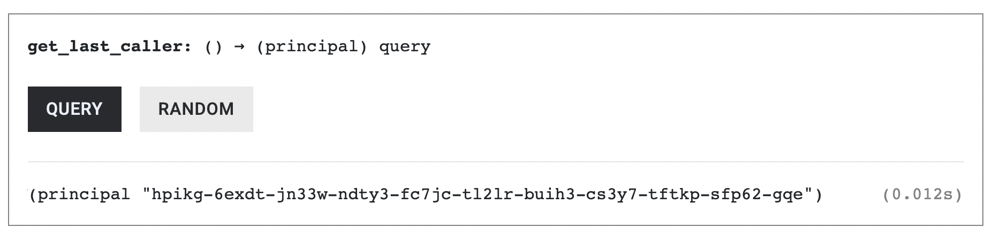
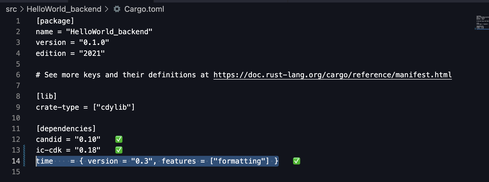

# System-Level Information In ICP

Smart contracts often need access to information provided by the blockchain itself. For example, a contract may need to know who is calling a function, what its own address is, or the current blockchain time in order to enforce access control, track activity, or implement time-based logic.

On the Internet Computer, this kind of system-level information is exposed through **System APIs**. In Rust canisters, System APIs are accessed through the `ic_cdk::api` module:

```rust
use ic_cdk::api;
```

In this chapter, we’ll explore the most commonly used System APIs and see how they map to familiar Solidity concepts. Specifically, we’ll learn how to:

* Identify who is calling a canister function using `msg_caller()`,
* retrieve the canister’s own principal with `canister_self()`, and
* work with blockchain time using `time()`.

To follow along with the examples in this chapter, create a new Rust canister project called `system_api` to follow along the code examples.

```rust
dfx new system_api --type rust --no-frontend
```

## Using `msg_caller()` to Identify the Caller

`msg_caller()` (like Solidity’s `msg.sender`) returns the `Principal` of the function caller.

To use `msg_caller` import it from the `ic_cdk::api` module. Also, import `Principal` from the `candid` crate:

```rust
use ic_cdk::api::msg_caller; // import msg_caller
use candid::Principal;
```

`msg_caller()`’s usage is demonstrated in the newly added function `get_msg_caller()` below, which simply returns the Principal of the caller.

```rust
use ic_cdk::api::msg_caller; // import msg_caller
use candid::Principal;

// New Function
#[ic_cdk::query]
fn get_msg_caller() -> Principal {
    msg_caller()
}
```

Now, deploy the canister and call `get_msg_caller()` from the Candid UI. Since the call is made without an authenticated identity, the returned value will be the anonymous principal (`2vxsx-fae`).


Every call carries a principal. If the message isn’t signed, the system assigns the anonymous principal `2vxsx-fae` as the caller’s principal and skips signature verification. You must decide whether to accept anonymous calls. If not, reject them explicitly:

### Storing the Last Caller’s Principal

So far, we’ve used `msg_caller()` to read the principal of the caller for a single function call. In many real-world canisters, however, we also want to _store_ this information in the canister’s state—for example, to track who last interacted with the contract or to implement access-control logic.

Let’s look at a simple example that records the principal of the last caller and exposes it through a query function.

The example below defines a thread-local state variable, `LAST_CALLER`, which stores a `Principal`. By default, it is set to the anonymous principal. The `set_last_caller()` update function records the principal of the current caller, and the `get_last_caller()` query function returns the stored value.

```rust
use candid::Principal;
use ic_cdk::api::msg_caller;
use std::cell::RefCell;

// Thread-local state to store the last caller's Principal.
// Initialized with the anonymous principal.
thread_local! {
static LAST_CALLER: RefCell<Principal> = RefCell::new(Principal::anonymous());
}

// Update function: Records the caller's principal in LAST_CALLER.
#[ic_cdk::update]
fn set_last_caller() {

    // with_borrow_mut() gives mutable access to the RefCell contents.
    LAST_CALLER.with_borrow_mut(|cell| {
        // * writes the new principal into the stored value.
        *cell = msg_caller();
    });
}

// Returns the stored caller principal
#[ic_cdk::query]
fn get_last_caller() -> Principal {
    // with_borrow() gives immutable access to the RefCell contents.
    LAST_CALLER.with_borrow(|cell| {
        // clone() is needed because Principal is not Copy.
        cell.clone()
    })
}

ic_cdk::export_candid!();
```

Calling `set_last_caller` from the `Candid UI` records the anonymous principal. Calling it from `dfx` records your developer identity principal.

Let’s try calling `set_last_caller` from dfx.

```rust
dfx canister call system_api_backend set_last_caller
```

Then verify that your developer identity principal was recorded:

```rust
dfx canister call system_api_backend get_last_caller
```

The `LAST_CALLER`’s value would be the principal of dfx’s developer identity. We could also re-confirm it through the **Candid UI**:



### Rejecting Anonymous Callers

In the previous example, we stored the principal of the last caller without distinguishing between authenticated and anonymous calls. While this works for demonstration purposes, the real-world canisters should only allow state changes from authenticated identities.

Let’s refine our example by rejecting anonymous callers and only updating the stored principal when the call is signed.

The `set_last_caller()` function below implements a conditional check that updates the stored principal only if the caller is **not** anonymous.

```rust
use candid::Principal;
use ic_cdk::api::msg_caller;
use std::cell::RefCell;

thread_local! {
		static LAST_CALLER: RefCell<Principal> = RefCell::new(Principal::anonymous());
}

#[ic_cdk::update]
fn set_last_caller() {

    // NEW CONDITIONAL CHECK
    if msg_caller() != Principal::anonymous() {
		    // Only allow authenticated identities to change the state
        LAST_CALLER.with_borrow_mut(|cell| *cell = msg_caller());
    }
}

#[ic_cdk::query]
fn get_last_caller() -> Principal {
    LAST_CALLER.with_borrow(|cell| cell.clone())
}

ic_cdk::export_candid!();
```

First, call `set_last_caller()` from `dfx`, using the command below:

```rust
dfx canister call system_api_backend set_last_caller
```

This will sends the request using an authenticated identity and updates `LAST_CALLER` with your developer principal.

Next, call `set_last_caller()` from the Candid UI, which sends an unauthenticated request. You’ll observe that this call is ignored and does not update `LAST_CALLER`.


## Initializing an Owner with the Deployer’s Principal

So far, we’ve used `msg_caller()` to identify who is calling a canister function and to control which callers are allowed to modify state. A common next step in many smart contracts is to assign an **owner**—an identity that has special permissions, such as updating configuration or managing access control.

Ownership is typically established at deployment time by recording the principal of the canister deployer. Let’s see how to initialize an owner using the deployer’s principal.

Clear out `lib.rs` and declare a static `RefCell<Principal>` initialized with the zero address.

```rust
use std::cell::RefCell;
use candid::Principal;
use ic_cdk::api::msg_caller;

thread_local! {
    static OWNER: RefCell<Principal> = RefCell::new(Principal::anonymous());
}
```

Next, add a constructor with `#[ic_cdk::init]` that sets `OWNER` to `msg_caller()`.

```rust
use std::cell::RefCell;
use candid::Principal;
use ic_cdk::api::msg_caller;

thread_local! {
    static OWNER: RefCell<Principal> = RefCell::new(Principal::anonymous());
}

// NEW CODE HERE
#[ic_cdk::init]
fn init() {
    OWNER.with_borrow_mut(|cell| *cell = msg_caller());
}
```

Lastly, add the `get_owner()` function. Since `Principal` is a **non-copy type**, returning it uses `.clone()`.

```rust
use candid::Principal;
use ic_cdk::api::msg_caller;
use std::cell::RefCell;

thread_local! {
    static OWNER: RefCell<Principal> = RefCell::new(Principal::anonymous());
}

#[ic_cdk::init]
fn init() {
    OWNER.with_borrow_mut(|cell| *cell = msg_caller());
}

// NEW CODE HERE
#[ic_cdk::query]
fn get_owner() -> Principal {
    OWNER.with_borrow(|cell| cell.clone())
}

ic_cdk::export_candid!();

```

Make sure that your dfx CLI is configured to using an identity instead of the anonymous principal:

```rust
dfx identity whoami
```

You can change which identity dfx is using through the command `dfx identity use <Identity-Name>`.

Run the following commands to update the `.did` file and trigger the deployment:

```rust
generate-did <Canister_name> && dfx deploy
```

`get_owner()` should return the principal of the identity that we deployed the contract with.


## Using `canister_self()` to Get Canister's Principal"

The `canister_self()` is similar to `address(this)` in Solidity. In the code below, the `get_self` function returns the canister’s principal using `canister_self()`:

```rust
use candid::Principal;
use ic_cdk::api::canister_self;

// NEW CODE HERE
#[ic_cdk::query]
fn get_self() -> Principal {
    canister_self() 
}

ic_cdk::export_candid!();
```

Deploy the canister and generate the candid interface. Then, call the `get_self()` from the Candid UI. You should expect that at the top left, your **Canister ID** matches the function output.


## System time: `time()`

The system APIs we have interacted with have been related to identity—who is calling a function and which principal owns the canister. Another important piece of system-provided context is time. Many canisters rely on timestamps to record when events occur, enforce deadlines, or implement time-based logic.

In ICP, the `time()` system API is conceptually to `block.timestamp` in Solidity, except that Solidity returns **seconds** since the Unix epoch (January 1, 1970), while ICP returns **nanoseconds** since the Unix epoch.

Here a simple example of a function returning `time()`:

```rust
use ic_cdk::api::time;

#[ic_cdk::query]
fn get_current_time() -> u64 {
    time()
}

ic_cdk::export_candid!();
```

The `time()` call always returns `u64` number. A raw result may look like this:

```
1754482914748072001
```

To convert this timestamp into a human-readable format, you’ll need to use an external `time` crate.

### Converting `time()` into a Human-Readable Timestamp

To convert the raw timestamp into a human-readable format, we first need to add an external dependency.

Open your `Cargo.toml` file and add the following line to the `[dependencies]` section. This will imports the `time` crate, which provides date and time formatting utilities.

```rust
time = { version = "0.3", features = ["formatting"] }
```



With the dependency added, the next step is to import the `time` crate into your Rust canister code. Specifically, we’ll use the `OffsetDateTime` type, which allows us to convert a Unix timestamp into a human-readable date and time in string format:

```rust
use time::OffsetDateTime;
```

The function, `get_human_readable_time()` below converts the raw `time()` value into a human-readable date and time using the `OffsetDateTime` method.

```rust
use ic_cdk::api::time;
use time::OffsetDateTime;

#[ic_cdk::query]
fn get_human_readable_time() -> String {
    OffsetDateTime::from_unix_timestamp_nanos(time() as i128)
        .unwrap()
        .to_string()
}

ic_cdk::export_candid!();
```

**Code Snippet Explanation**

* `OffsetDateTime::from_unix_timestamp_nanos(time() as i128)` returns a `Result`, which is a type that represents either success `Ok` with a value or failure `Err` with an error (for example, if the timestamp is invalid).
* `.unwrap()` in Rust forces that Result to give you its value — but if it’s an error, it panics and stops execution. Finally,
* `.to_string()` converts the extracted value into a human-readable String output.

An example result from `get_human_readable_time()`:


The date format is:

* `YYYY` — 4-digit year
* `MM` — 2-digit month
* `DD` — 2-digit day
* `HH` — 24-hour format hour
* `MM` — minutes
* `SS` — seconds
* `.ffffff` — microseconds
* `±HH:MM:SS` — UTC offset

### Manipulating Timestamps: One Minute Later

You can also manipulate the timestamp by adding a duration. For example, here’s how to output **one minute later** than the current consensus time.

First declare a one minute constant in nano seconds.

```rust
use ic_cdk::api::time;
use time::OffsetDateTime;

// Global constants for time units in nanoseconds
const ONE_MINUTE: u64 = 60 * 1_000_000_000;
```

Then add `ONE_MINUTE` to the current time.

```rust
use ic_cdk::api::time;
use time::OffsetDateTime;

// Global constants for time units in nanoseconds
const ONE_MINUTE: u64 = 60 * 1_000_000_000;

#[ic_cdk::query]
fn one_minute_later() -> u64 {
		let current_time = time();
		let one_min_later = current_time + ONE_MINUTE;
		one_min_later
}

ic_cdk::export_candid!();
```

This returns the current Unix time + one minute (nanoseconds).

If you want to output a human readable time for `one_min_later`, format it using the `OffsetDateTime` method from the _time_ crate and change the function return type to `String`.

```rust
use ic_cdk::api::time;
use time::OffsetDateTime;

// Global constants for time units in nanoseconds
const ONE_MINUTE: u64 = 60 * 1_000_000_000;

#[ic_cdk::query]
fn one_minute_later() -> String {
		let current_time = time();
		let one_min_later = current_time + ONE_MINUTE;
		
		//format one_min_later
    OffsetDateTime::from_unix_timestamp_nanos(one_min_later as i128)
    .unwrap()
    .to_string()
}

ic_cdk::export_candid!();
```

## Wrapping up

System APIs are how a canister interacts with the IC runtime to access runtime context and system features that aren’t passed in as function arguments (for example, the caller’s identity, the current time, and cycles-related information).

Inter-canister calls are also powered by the System API. In Rust, the CDK exposes this through the `Call` builder, which we’ll learn in Module 4.

In the next article, we’ll cover error handling—how to return errors or trap to abort execution, and how to structure code so failures don’t leave your canister in an inconsistent state.
