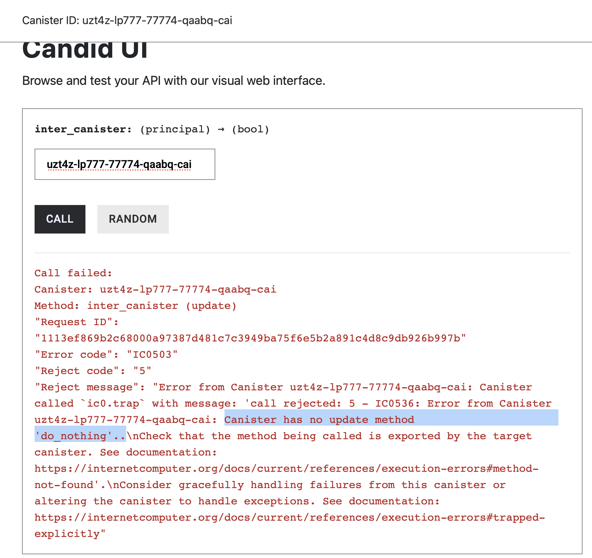
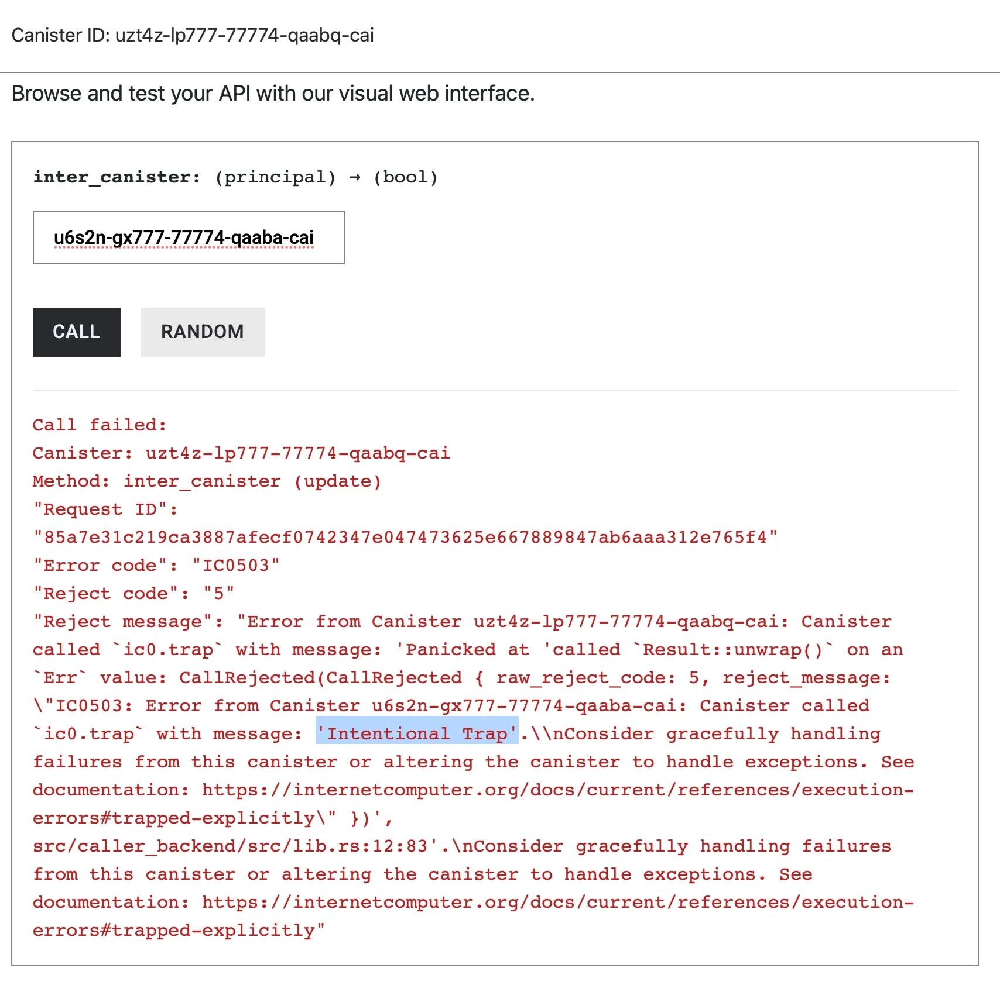

# Inter-Canister Calls

Smart contracts often need to interact with other contracts to share liquidity, compose with external protocols, or access shared infrastructure. In this article, we’ll learn how canisters can call functions from another canister.


## The `Call` System API

On the Internet Computer, a canister calls functions on another canister through the `Call` System API. In Rust canisters, you can call this API by importing `Call` from the [`ic_cdk::call`](https://docs.rs/ic-cdk/latest/src/ic_cdk/call.rs.html#160-166) library:

```rust
use ic_cdk::call::Call;
```

`Call` is a builder **struct** for configuring and executing an inter-canister call. To create a `Call`, you start with one of these two constructor functions:

* `Call::unbounded_wait(...)`
* `Call::bounded_wait(...)`

Both constructors take two arguments:

* the **target canister principal** (`Principal`), and
* the **method name** (the function you want to call on that canister).

Here’s what constructing an inter-canister call looks like:

*   **`Call::unbounded_wait()`:**

    ```rust
    use ic_cdk::call::Call;

    async fn inter_canister_call() {

    		// Unbounded Wait
    		let result = Call::unbounded_wait("target_canister", "function_name").await;
    }
    ```
*   **`Call::bounded_wait()`:**

    ```rust
    use ic_cdk::call::Call;

    async fn inter_canister_call() {
    		
    		// Bounded Wait
    		let result = Call::bounded_wait("target_canister", "function_name").await;
    }
    ```

The difference between the two constructors is their **wait policy**:

* `unbounded_wait` waits **indefinitely** for the called canister to reply and
* `bounded_wait` waits up to a **bounded time** for the reply.

We’ll get to the difference of the two constructors later.

After constructing the `Call`, you can add optional configuration with builder methods such as `.with_args(...)` to attach function arguments, and `.with_cycles(...)` to send Cycles.

## Inter-canister calls are asynchronous

Inter-canister calls execute asynchronously. The topic of asynchronous execution and its implication on state-changes are discussed in the second article. In short, they are executed independently by the runtime on a separate transaction from our own.

### `.await` and `async`

In Rust, calling an asynchronous function or System API must be followed by the `.await` keyword. Without `.await`, the function will not actually be executed. Therefore, `Call::unbounded_wait()` **must** be followed by `.await` to call the function as shown in the code snippet below.

```rust
use ic_cdk::call::Call;

#[ic_cdk::update]
fn inter_canister_call() {

		//*** .await keyword added ***
		let result = Call::unbounded_wait(target_canister, "function_name").await;
}
```

Because `.await` is used, the function that calls `Call::unbounded_wait()` **must** be declared as `async` as shown in the example below:

```rust
use ic_cdk::call::Call;

// *** async keyword added ***
#[ic_cdk::update]
async fn inter_canister_call() {

		//*** .await keyword added ***
		let result = Call::unbounded_wait(target_canister, "function_name").await;
}
```

## **The `Call` System API Returns** a `Result`

The response that the `Call` API returns will be a `Result` type. Specifically, `Ok(Response)` or `Err(CallFailed)`.

* `Ok(Response)` means the inter-canister call is successful. `Response` is a raw candid encoded value returned by the remote function.
* `Err(CallFailed)` means that the inter-canister call failed. `CallFailed` is an error type containing a rejection code and a message that describes **why** the call failed. Details of this error type will be discussed later.

### A Simple Check for an `Ok(Response)` or `Err(CallFailed)`

To simply identify whether the inter-canister call succeeded, we can use the `.is_ok()` method. It returns:

* `true` if the `Result` is `Ok(Response)`,
* `false` if it is `Err(error)`.

Here’s a code snippet that shows how to use `.is_ok()` on `result`.

```rust
#[ic_cdk::update]
async fn inter_canister(_Callee: Principal) -> bool {

		let result = Call::unbounded_wait(_Callee, "function_name").await;
		
		let ok = result.is_ok();
		
		ok // returns true or false
}
```

In Solidity, this is similar to a low-level contract call. The example below shows a low-level call that plays a role similar to `Call::unbounded_wait()`. The `bool ok` value is analogous to calling `.is_ok()` in our Rust code: it indicates whether the call succeeded.

```rust
function callFunction(address target) external returns (bool) {
    (bool ok, bytes memory ret ) = target.call(
        abi.encodeWithSignature("function_name()")
    );
    
    return ok;
}
```

To get started with a simple inter-canister call, we’ll first utilize `Call::unbounded_wait()` to call a function on another canister, then progressively add more features (arguments, cycles, error handling, and decoding return values).

## Simple Inter-Canister Call Example

In this section we’ll create an example of a successful inter-canister call.

Canister `A` below has a function `call_do_nothing` that calls canister `B`'s `do_nothing` with `Call::unbounded_wait()`.

```rust
use candid::Principal;
use ic_cdk::call::Call;

#[ic_cdk::update]
async fn call_do_nothing(canister_b: Principal) -> bool {
    let result = Call::unbounded_wait(canister_b, "do_nothing").await;

    let ok = result.is_ok();
            
    ok // returns true or false
}

ic_cdk::export_candid!();
```

Canister `B` has a function that does and returns nothing.

```rust
#[ic_cdk::update]
fn do_nothing() {
		// actually do nothing
}

ic_cdk::export_candid!();
```

First deploy Canister `B` and obtain its Canister ID, e.g. `u6s2n-gx777-77774-qaaba-cai`.


Next, deploy Canister `A`. Call `call_do_nothing` and pass **`B`**’s principal to its parameter. You would expect it to return `true`.

```rust
use candid::Principal;
use ic_cdk::call::Call;

#[ic_cdk::update]
async fn call_do_nothing(canister_b: Principal) -> bool {
    let result = Call::unbounded_wait(canister_b, "do_nothing").await;

    let ok = result.is_ok();
            
    ok // returns true or false
}

ic_cdk::export_candid!();
```

`call_do_nothing` should return true:


Under the hood,

1. `Call::unbounded_wait(_callee, "do_nothing").await;` will return a response of type `Result<Response, CallFailed>`.
2. `let ok = result.is_ok();` checks for the `Ok()` wrapper and returns `true` if so and `false` otherwise.

Inter-canister calls that succeed returns an `Ok(Response)`, with `Response` being the function’s raw return value.

## Failed Inter-canister Call Example: `Err(CallFailed)`

Upon setting the wrong canister ID or an invalid method, the result that the `Call` API returns will be of type `Err(CallFailed)`. The `CallFailed` payload will contain one of the following reasons:

1. The canister ID or the method doesn’t exist.
2. The canister trapped.
3. The Cycles balance of the target canister is insufficient to execute your inter-canister call.
4. The network failed to route your call (cases of such are rare).

In Canister `A`, slightly change the target canister’s principal so that it’s wrong. `call_do_nothing` would return **false**.


What’s happening is that `Call::unbounded_wait()` returns an error, `Err(CallFailed)`. `.is_ok()` returns `false` if the response is an `Err(CallFailed)`.

### Inspecting the `CallFailed` message

We can unwrap `Err(CallFailed)` to get the `CallFailed` message and have a clearer picture of why the inter-canister call failed.

The logic is modified so that we unwrap the `Err(CallFailed)` message. Unwrapping an error type would result in a panic, which reverts the function.

```rust
use candid::Principal;
use ic_cdk::call::Call;

#[ic_cdk::update]
async fn inter_canister(_callee: Principal) -> bool {

    let result = Call::unbounded_wait(_callee, "do_nothing").await;

    let ok = result.is_ok();

    if ok == false {
        // Print the error if the call failed
        ic_cdk::api::trap(result.unwrap_err().to_string());
    }

    true
}

ic_cdk::export_candid!();
```

* `result.unwrap_err.to_string()` unwraps `Err(CallFailed)` and returns the `CallFailed` message in a string form.

Call the function and you would see why the inter-canister call fails : _“Canister has no update method `do_nothing`”_



Let’s give another error example where the fault comes from the Canister `B`’s function trapping.

The `do_nothing()` at Canister `B` intentionally traps:

```rust
// Canister B

#[ic_cdk::update]
fn do_nothing() {
		ic_cdk::api::trap("Intentional Trap");
		
}

ic_cdk::export_candid!();
```

Let’s inspect the error message that `call_do_nothing()` gets. Call `call_do_nothing` again and pass Canister `B`’s Principal. Observe that we obtain an error message containing “Intentional Trap” from the callee canister.



The error message that the called canister returns is part of the `Err(CallFailed)` result of the inter-canister call.

In the next article, we’ll learn how to pass arguments to inter-canister calls and how to decode the values returned by the called function.
