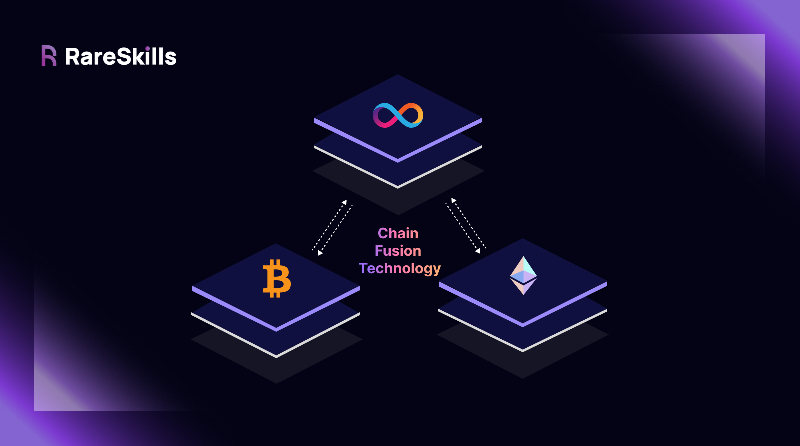

# ICP for EVM Developers

This course helps engineers with an Ethereum background quickly grasp smart contract development on the Internet Computer Protocol (ICP). Our goal is to streamline your journey towards learning how to program ICP smart contracts and utilize ICP’s [**Chain Fusion Technology**](https://learn.internetcomputer.org/hc/en-us/articles/34329023770260-Chain-Fusion).

### Chain Fusion Technology

ICP smart contracts have the ability to create and send transactions to EVM-compatible blockchains _(e.g. Ethereum, Optimism, and Base)_, as well as non-EVM chains like Solana or Bitcoin. This feature of the ICP blockchain is called **Chain Fusion Technology.**

Chain Fusion Technology is made possible by two key features of the Internet Computer Protocol: **HTTP Outcalls** and **Threshold Signatures**. Briefly,

* **HTTP Outcalls** allow ICP smart contracts to perform native HTTP requests to external APIs.
* **Threshold Signatures** enable canisters on the Internet Computer to generate their own unique ECDSA and Schnorr signatures directly on-chain to sign arbitrary messages or transactions.

Combined, these features enable canisters to create signed artifacts or transactions and submit them directly to Ethereum RPCs and Solana RPCs.

We will focuses on learning how to program an ICP canister written in Rust as well as its integration with the Ethereum and Solana blockchain. Future modules may potentially cover ICP's [direct Bitcoin integration](https://internetcomputer.org/docs/build-on-btc/).

### A Hands-On Learning Journey

This course focuses on practical learning and efficiency. Where possible, we’ll put your existing Solidity experience to use. Bite-sized exercises are included to solidify ICP concepts, and key architectural ideas are explained through supporting articles.

#### Projects You’ll Build

* Fungible tokens
* Web3 oracles
* Co-processors for Ethereum (Outsource heavy computations to canisters)
* Cross-chain messaging protocols

Towards the end of this course, you’ll build a cross-chain bridge canister that facilitates message passing and token bridging between EVM chains (EVM ↔ EVM), as well as between EVM and Solana (EVM ↔ Solana).

### Rust Prerequisites

This course assumes you already know Rust, including ownership, borrowing, and basic datatypes as these topics have been extensively covered by outside resources.

### Authorship and Acknowledgement&#x20;

We would like to thank Ujjwal, [Faybian Byrd](https://www.linkedin.com/in/faybianbyrd/), Serah and Moritz for their careful reviews and meaningful contributions.&#x20;

This work was co-authored by Aymeric Taylor ([LinkedIn](https://www.linkedin.com/in/aymeric-russel-taylor/), [Twitter](https://twitter.com/AymerETH)) and supported by a grant from the Dfinity foundation.

### Course Outline

#### Module 1: Programming a Rust Canister

* [Hello World and Developer Environment Installation](https://github.com/RareSkills/icp-for-evm/blob/main/Module%201:%20Programming%20a%20Rust%20Canister/Chapter%201%20Hello%20World%20and%20Developer%20Environment%20Installation.md)
* [Function Visibility and Mutability](https://github.com/RareSkills/icp-for-evm/blob/main/Module%201:%20Programming%20a%20Rust%20Canister/Chapter%202%20%20Function%20Visibility%20and%20Mutability.md)
* [State/Storage Variables](https://github.com/RareSkills/icp-for-evm/blob/main/Module%201:%20Programming%20a%20Rust%20Canister/Chapter%203%20State%20Storage%20Variables.md)
* [The Update Function](https://github.com/RareSkills/icp-for-evm/blob/main/module-1-programming-a-rust-canister/the-update-function.md)
* [Safe Storage and Access With Thread-Local Storage and RefCells](https://github.com/RareSkills/icp-for-evm/blob/main/Module%201:%20Programming%20a%20Rust%20Canister/Chapter%205%20Safe%20Storage%20and%20Access%20With%20Thread-Local%20Storage.md)
* [Composite Types](https://github.com/RareSkills/icp-for-evm/blob/main/Module%201:%20Programming%20a%20Rust%20Canister/Chapter%206%20Composite%20Types.md)

#### Module 2: Canister Initialization, System APIs, and Error Handling

* [Initialize Canister State and Canister Upgrades](https://github.com/RareSkills/icp-for-evm/blob/main/Module%202:%20Canister%20Initialization,%20System%20APIs,%20and%20Error%20Handling/Chapter%207%20Initialize%20Canister%20State%20and%20Canister%20Upgrades.md)
* [System-Level Information in ICP](https://github.com/RareSkills/icp-for-evm/blob/main/Module%202:%20Canister%20Initialization,%20System%20APIs,%20and%20Error%20Handling/Chapter%208%20System-Level%20Information%20In%20ICP.md)
* [Traps and Error Handling](https://github.com/RareSkills/icp-for-evm/blob/main/Module%202:%20Canister%20Initialization,%20System%20APIs,%20and%20Error%20Handling/Chapter%209%20Traps%20and%20Error%20Handling.md)
* [Simple Token Canister Project](https://github.com/RareSkills/icp-for-evm/blob/main/Module%202:%20Canister%20Initialization,%20System%20APIs,%20and%20Error%20Handling/Chapter%2010%20Simple%20Token%20Canister%20Project.md)

#### Module 3: ICP Token, System Canisters and The Reverse Gas Model

* [Interact with Canisters Using The ICP JavaScript Agent Library](https://github.com/RareSkills/icp-for-evm/blob/main/Module%203:%20ICP%20Token,%20System%20Canisters%20and%20The%20Reverse%20Gas%20Model/Chapter%2011%20Interact%20with%20Canisters%20Using%20The%20ICP%20JavaScript%20Agent.md)
* [System Canisters (NNS) and The ICP Token](https://github.com/RareSkills/icp-for-evm/blob/main/Module%203:%20ICP%20Token,%20System%20Canisters%20and%20The%20Reverse%20Gas%20Model/Chapter%2012%20System%20Canisters%20\(NNS\)%20and%20The%20ICP%20Token.md)
* [The Reverse Gas Model of ICP](https://github.com/RareSkills/icp-for-evm/blob/main/Module%203:%20ICP%20Token,%20System%20Canisters%20and%20The%20Reverse%20Gas%20Model/Chapter%2013%20The%20Reverse%20Gas%20Model%20of%20ICP.md)
* [Canisters Pay for Storage](https://github.com/RareSkills/icp-for-evm/blob/main/Module%203:%20ICP%20Token,%20System%20Canisters%20and%20The%20Reverse%20Gas%20Model/Chapter%2014%20Canisters%20Pay%20for%20Storage.md)

#### Module 4: Inter-Canister Communication and Asynchronous Execution

* [Inter-Canister Calls](https://github.com/RareSkills/icp-for-evm/blob/main/Module%204:%20Inter-Canister%20Communication%20and%20Asynchronous%20Execution%20/Chapter%2015%20Inter-Canister%20Calls.md)
* [Decoding and Encoding Inter-Canister Arguments](https://github.com/RareSkills/icp-for-evm/blob/main/Module%204:%20Inter-Canister%20Communication%20and%20Asynchronous%20Execution%20/Chapter%2016%20Decoding%20and%20Encoding%20Inter-Canister%20Arguments.md)
* [unbounded\_wait() vs bounded\_wait()](https://github.com/RareSkills/icp-for-evm/blob/main/Module%204:%20Inter-Canister%20Communication%20and%20Asynchronous%20Execution%20/Chapter%2017%20unbounded_wait\(\)%20vs%20bounded_wait\(\).md)
* [Asynchronous Execution and It's Effect on State-Changes](https://github.com/RareSkills/icp-for-evm/blob/main/Module%204:%20Inter-Canister%20Communication%20and%20Asynchronous%20Execution%20/Chapter%2018%20Asynchronous%20Execution%20And%20It%E2%80%99s%20Effect%20On%20State-Changes.md)
* [Canisters are Non-Blocking](https://github.com/RareSkills/icp-for-evm/blob/main/Module%204:%20Inter-Canister%20Communication%20and%20Asynchronous%20Execution%20/Chapter%2019%20Canisters%20are%20Non-Blocking.md)
* [Transfer Cycles Between Canisters](https://github.com/RareSkills/icp-for-evm/blob/main/Module%204:%20Inter-Canister%20Communication%20and%20Asynchronous%20Execution%20/Chapter%2020%20Transfer%20Cycles%20Between%20Canisters.md)

#### Module 5: Coming Soon

### Proposing changes

If you want to suggest an edit or improvement, please open an **Issue** or submit a **Pull Request** on the GitHub repo: [https://github.com/RareSkills/icp-for-evm](https://github.com/RareSkills/icp-for-evm).

### Additional Resources

* **Community Forum**: [ICP Developer Forum](https://forum.dfinity.org/)
* **Discord**: [Developer Discord](https://discord.internetcomputer.org/)
* **YouTube Tutorials**: [DFINITY YouTube Channel](https://www.youtube.com/c/DFINITY)
* **Developer Grants**: [ICP Community Developer Grants](https://dfinity.org/grants)
