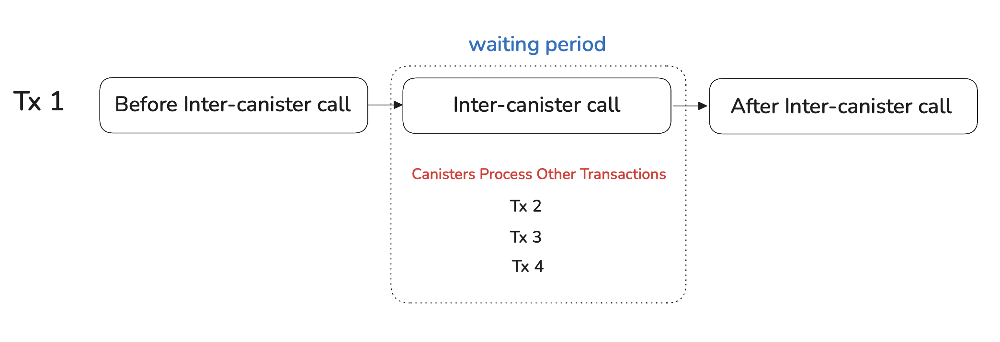
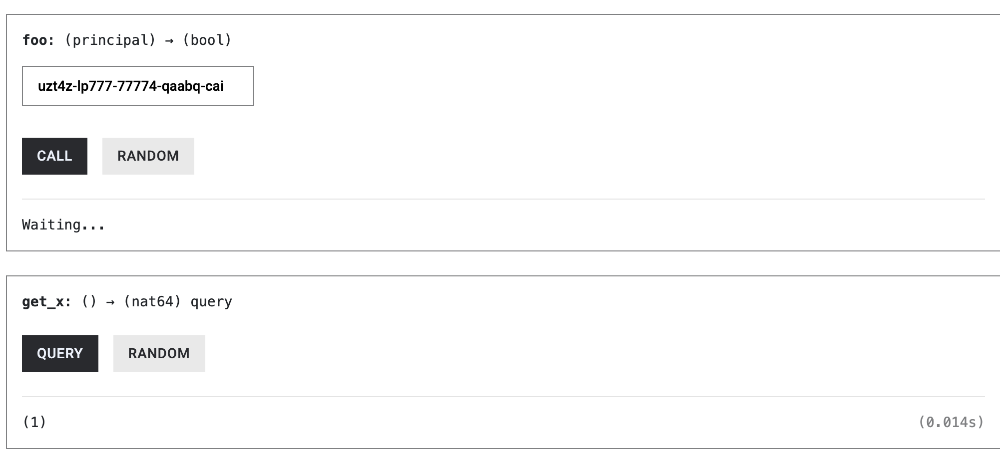
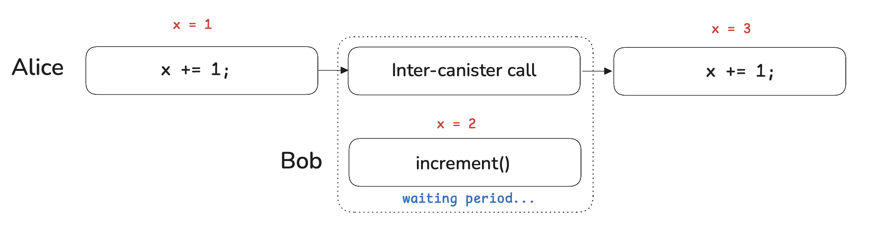

# Canisters are Non-Blocking

When a canister makes an inter-canister call and waits for the response, it **does not block** or **halt execution**. Instead, the canister keeps executing **other transactions** until the inter-canister call returns.

The diagram below illustrates this behavior. The canister begins processing **`Tx₁`**, which performs an inter-canister call. While `Tx₁` is waiting for the response, the canister continues processing **`Tx₂`, `Tx₃`, and `Tx₄`** sequentially. Once the response arrives, the canister resumes execution of **`Tx₁`**.



In this article, we explore what non-blocking execution means in practice. Specifically, we demonstrate how concurrent calls can observe and modify intermediate canister state, and why this requires extra care when writing asynchronous functions.

## **Intermediate State Is Observable During Async Calls**

To see how non-blocking execution affects visibility of state, consider two canisters: **A** and **B**.

Canister **A** exposes an asynchronous function `foo()` that increments a state variable `X` twice:

- Once **before** making an inter-canister call to `B.bar()`, and
- Once **after** that call returns.

```rust
use std::cell::RefCell;

use candid::Principal;
use ic_cdk::{call::Call, update};

thread_local! {
    static X: RefCell<u64> = RefCell::new(0);
}

#[update]
async fn foo(callee: Principal) -> bool {
    increment();

    // (2) non-blocking wait for B.bar()
    let _result = Call::bounded_wait(callee, "bar").await;

    increment();

    true
}

#[update]
fn increment() {
    X.with_borrow_mut(|cell| *cell += 1);
}

#[ic_cdk::query]
fn get_x() -> u64 {
    X.with_borrow(|cell| *cell)
}

ic_cdk::export_candid!();
```

Canister **B** provides a deliberately slow function `bar()`, which takes roughly **13 seconds** to execute.

```rust
use ic_cdk::update;

#[update]
fn bar() -> u64 {
    // Computationally heavy and slow
    let limit: u64 = 3_900_000_000;
    let mut total: u64 = 0;

    for i in 0..limit {
        // Do something simple but not optimizable to a no-op
        total = total.wrapping_add(i ^ (i >> 3));
    }

    total
}

ic_cdk::export_candid!();
```

Now suppose **Alice** calls `A.foo()` when `X = 0`.

1. `foo()` first increments `X` from `0` to `1`.
2. It then makes an asynchronous call to `B.bar()` and suspends execution while waiting for the response.

At this point, the key observation is that **the increment to X has already been committed**. While `foo()` is suspended, the canister is free to process other incoming messages.

During this waiting period, **Bob** can call `get_x()` and observe the current state of the canister. His call will return **`1`**, reflecting the state committed *before* the inter-canister call.


You can reproduce this behavior yourself:

1. Deploy canisters **A** and **B**.
2. Call `A.foo()`.
3. Immediately call `get_x()` while `foo()` is still waiting.

It should return `1` as shown below:



Once `B.bar()` finishes and `foo()` resumes, `foo()` increments X again and completes. A subsequent call to `get_x()` should now returns 2.


- The **first** `get_x()` runs while `foo()` is suspended and observes the **intermediate state**.
- The **second** `get_x()` runs after `foo()` finishes and observes the **final state**.

This example demonstrates an important property of the Internet Computer’s execution model: **state changes made before an await are immediately visible to other calls**.

In the next section, we’ll see that other calls can do more than merely *observe* this intermediate state — they can **modify it**, causing an asynchronous function to resume in a different state than the one it originally started with.

## **Intermediate State Can Be Modified While an Async Call Is Suspended**

So far, we’ve seen that state changes made **before** an await become immediately **observable** to other calls. More importantly, those calls are not limited to passive observation — they can actively **modify** the canister’s state while an asynchronous function is suspended.

Revisiting the previous example, suppose **Bob** calls `increment()` while **Alice’s** call to `foo()` is still waiting on `B.bar()`.



Here is the sequence of events:

- Alice calls `foo()` when `X = 0`.
- `foo()` increments X to 1 and then awaits the response from `B.bar()`.
- While `foo()` is suspended, Bob calls `increment()`, updating `X` from 1 to 2.
- When `foo()` resumes, it observes the **new** state (`X = 2`) and increments it again, resulting in `X = 3`.

The key takeaway is that an asynchronous function on the Internet Computer does **not** execute against a single, stable snapshot of canister state. Any state that was committed before an await can be **changed by other messages** before the function resumes.

As a result, asynchronous functions may resume in a **different state than the one they started with**, even if they themselves made no additional changes during the waiting period.

In the next section, we’ll examine what this means for real canister logic.

### Example of An Async Function Resuming Into a New Canister State

In the previous section, we saw that other calls can **modify** a canister’s state while an asynchronous function is suspended. We now make this effect explicit by adding a simple consistency check to detect whether the state has changed while foo() was waiting.

We extend canister **A** to record two snapshots of the state variable X:

- `x_before`: the value of X **immediately before** the inter-canister call, and
- `x_after`: the value of X **immediately after** the call returns.

If these two values differ, it means that some other transaction modified X while `foo()` was suspended. In that case, `foo()` returns false early instead of proceeding.

```rust
**use** std**::**cell**::**RefCell;
**use** ic_cdk**::**{call**::**Call, update};
**use** candid**::**Principal;

thread_local!{
		static X : RefCell<u64> = RefCell::new(0);
}

#[update]
**async** **fn** **foo**(callee**:**Principal) **->** bool {

    increment();
    
    // value of x BEFORE inter-canister call
    let x_before = X.with_borrow(|cell|*cell);

    let _ = Call::bounded_wait("B", "bar").await;
    
    // value of x AFTER inter-canister call
    let X_after = X.with_borrow(|cell|*cell);
    
    // check that the X hasn't changed, return false if it has
    if X_before != X_after {
		    return false;
    }

    increment()
    
    return true;
}

#[ic_cdk::update]
fn increment() {
		X.with_borrow_mut(|cell| *cell +=1 );
}

#[query]
fn get_x() -> u64 {
    X.with_borrow(|cell|*cell)
}

ic_cdk::export_candid!()
```

To observe this behavior, redeploy canister **A** and call `foo()`. While `foo()` is waiting on `B.bar()`, call `increment()` from another identity. When `foo()` resumes, it will detect that `x_before ≠ x_after` and immediately return false.


This example highlights a crucial implication of the Internet Computer’s non-blocking execution model: **local variables that capture state before an await can become stale by the time execution resumes**.

As a result, asynchronous canister functions must be written defensively. Any logic that depends on state read before an inter-canister call must be **revalidated, recomputed, or explicitly guarded** when the function resumes.

## **Designing Correct Async Code in a Non-Blocking Canister Model**

The examples above demonstrate a fundamental property of the Internet Computer’s execution model: **a canister does not remain idle while waiting for an asynchronous call to return**. Instead, it continues processing other messages, which may observe or modify the canister’s state.

As a result, asynchronous functions must be written with the assumption that **state may change across an await**. Any design that implicitly relies on the state remaining unchanged while an inter-canister call is in flight is incorrect.

A particularly dangerous pattern is to:

1. read some state,
2. perform an inter-canister call, and then
3. reuse the previously read value to update the state.

The following example illustrates this mistake.

```rust
// Example vault contract

async fn withdraw(amount: u64) -> Result<(), Error> {

    // (1) Read the vault's balance
    let balance = get_balance();
    // check if they enough funds

    // (2) withdraw icp tokens to user
    Call::bounded_wait("icp_ledger", "transfer", amount).await;

    // (3) Use the old `balance` to calculate for the new balance
    set_balance(balance - amount);     // may be stale!
    
    Ok(())
}
```

While the function is suspended at the await, other messages may execute:

- another user might deposit,
- another withdrawal might already have reduced the balance,
- an administrative operation may have updated state.

When the function resumes, the local variable balance may no longer reflect the canister’s actual state, yet it is still being used to compute the new balance. This kind of bug is subtle, easy to miss in review, and difficult to detect in testing.

To write correct asynchronous canister code, we must instead **acknowledge that state changes may be committed before an await**, and structure our logic accordingly.

One common approach is to **anticipate the state change** before making the inter-canister call, then either:

• keep the change if the call succeeds, or
• explicitly roll it back if the call fails.

Because the state may continue to change while the function is suspended, rollback logic must also **re-read the current state** to ensure that only the intended changes are undone.

```rust
// Anyone can withdraw
async fn withdraw(amount: u64) -> bool {

    // Read the vault's balance
    let balance = get_balance();
    
    // Anticipate the change
    set_balance(balance - amount);     

    // withdraw tokens to caller
    let result = Call::bounded_wait("icp_ledger", "transfer", amount).await;
    
    // explicitly handle the inter-canister call
	  if result.is_ok(){
		    // state-changes were already made, do nothing
		    // return ok
		    return true;
			  
	  } else{
			  // result is error
			  
			  // Read the new vault's balance
		    let new_balance = get_balance();
		    
		    // add the balance back to the vault
		    set_balance(balance + amount); 
			  
			  // return false indicating that the withdraw failed
			  return false;
	  }
}
```

This pattern acknowledges that **state changes may be committed before the await**, avoids relying on **stale local variables** after an inter-canister call, and correctly **recomputes and rolls back** state when the call fails.

One of the most complex concepts to grasp is ICP’s asynchronous execution model. Now that we have covered it, when performing an HTTP Outcall, which is an asynchronous System API that allows canisters to perform HTTP requests to web2 APIs, it also follows the pattern above. 

In the next article, we’ll learn how to send Cycles between canisters, which is similar to sending Ether between Solidity contracts.