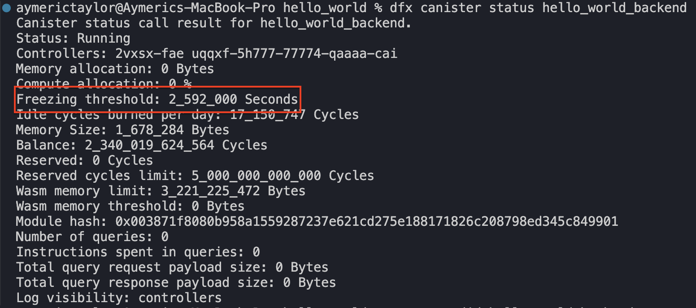

# Canisters Pay for Storage

The Internet Computer Protocol charges canisters a recurring fee in `Cycles` for the on-chain storage space they occupy. The storage space a canister is accounted for includes both its **bytecode** and **state**.

### Storage Fees Overview

As a general overview, the storage fee of `1 Gib` of data is `127_000 Cycles` per second. Over a year, it amounts to 4 trillion `Cycles` or around $5. These fees are taken out of the canister’s Cycles Balance.

You can observe the storage fees in real time by deploying a canister and monitoring its Cycles Balance over time.

## Proof of Storage Fees

Deploy any canister and **do not call any of its functions**:

```rust
dfx new do_nothing --type rust --no-frontend
dfx deploy
```

Check the Cycles balance of the canister with the command below and compare it with the balance 1 minute **after**:

```solidity
dfx canister status <Canister-ID>
```

You will see that `Cycles Balance` **reduces** because **t**he network continuously deducts `Cycles` from the canister to pay for storage fees.

`Before`:

**Balance**: 2_553_98**1_994_860** Cycles


`1 minute After`:

**Balance**: 2_553_98**0_664_965** Cycles


The `Cycles` balance decreased by approximately `1_330_000 Cycles` in just around one minute. The network continuously charges canisters for storing data on-chain, regardless of on-chain activities.

## How Storage Fees Are Calculated

Storage fees on the Internet Computer are charged as a **fixed number of Cycles per unit of storage per second**, proportional to how much on-chain space a canister occupies. This storage includes **both the canister’s bytecode and its persisted state**.

### **Base Storage Rate**

As a reference point previously discussed, the network charges **`127,000 Cycles` per second for 1 GiB of storage.**

Since storage fees are charged continuously, this cost accrues every second, regardless of whether the canister is actively processing requests.

Over the course of a year, this works out to:

- **1 GiB ≈ 4 trillion Cycles per year**
- Which is approximately **$5 USD per year**, based on current conversion rates

### **Scaling Down: Cost per MiB**

Because **1 GiB = 1024 MiB**, we can derive the per-MiB storage cost by dividing proportionally:

$$
\frac{127{,}000\ \text{Cycles/sec}}{1024}
\approx 124\ \text{Cycles/sec per MiB}
$$

Suppose a canister (including its bytecode and state) occupies **10 MiB** of on-chain storage.

Using the per-MiB rate:

- **10 MiB ≈ 1,240 Cycles per second**

Over a year, this amounts to approximately:

- **0.01 GiB × $5 ≈ $0.05 USD per year**

This illustrates that **small canisters are inexpensive to store**, but costs grow predictably as storage usage increases.

## What Happens When A Canister Runs Out Of Cycles?

If a canister runs out of `Cycles`, **all of its data will be deleted** from the protocol—this includes includes its **storage** and **bytecode**. Therefore, we need to actively monitor the canister’s `Cycles` balance and plan ahead.

Take into consideration that the canister has sufficient `Cycles` to cover:

1. **Computation costs** for user function calls.
2. **Storage fees**.

### Cycles Balance Safety Mechanism: The Freezing Threshold

Canisters have a safety mechanism called the **freezing threshold**. When the `Cycles` balance becomes low and falls to a certain threshold amount, the freezing threshold mechanism **stops executing all function calls to the canister.**

The freezing threshold acts as a safety buffer that protects your canister from running out of `Cycles` unexpectedly. This gives the developers time during the “frozen” period, to:

- top-up the canister with more `Cycles`
- or leave it be. The canister’s `Cycles` balance would eventually run out because of storage fees and the canister’s data will be deleted permanently from the protocol.

You can see the freezing threshold in the **canister status**, which indicates how long much time the canister has when the freezing threshold is activated before it runs out of `Cycles`.



**`2_592_000** seconds` converts to **30** days. During these **30** days grace period, the Cycles Balance will be continually depleted by the storage fees and you need top up the canister with more `Cycles` or all of its data will be deleted.

### Conclusion

Every canister continuously pays for the space it occupies, including both its bytecode and its persisted state, using `Cycles`, regardless of whether it is actively processing requests. 

By understanding how storage fees are calculated, how Cycles are depleted over time, and how the freezing threshold protects canisters from sudden deletion, developers can design canisters that are predictable, resilient, and sustainable over the long term. 

In the next article, we we discuss how to perform inter-canister calls