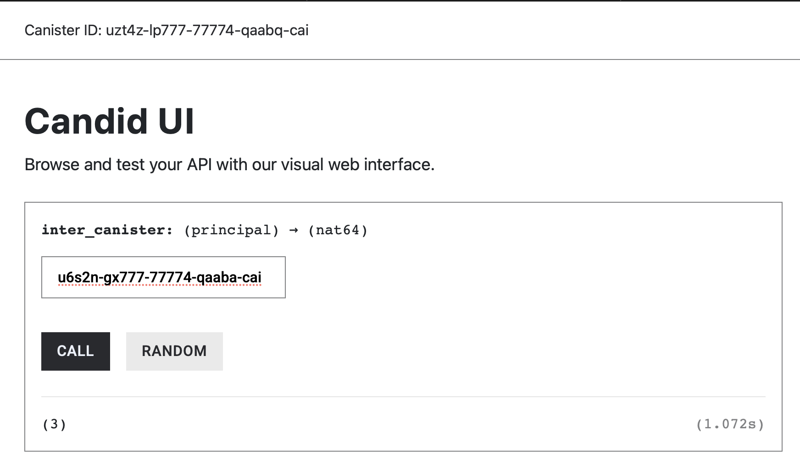

# Decoding and Encoding Inter-Canister Arguments

When an inter-canister call succeeds, the returned value is not immediately available in a usable Rust type. Instead, the response is wrapped inside `Ok(Response)` and encoded using Candid, the serialization format used by the Internet Computer. 

To access the actual value, we must first unwrap the `Ok(Response)` to obtain the raw Candid-encoded data (`Response`), and then deserialize it into the expected Rust type. In this article, we walk through this process step by step, using the `.candid::<Type>()` method to decode the response from an inter-canister call.

## **Decoding a Return Value from an Inter-Canister Call**

Replace the code of **Canister B** that we created earlier with the following implementation:

```rust
#[ic_cdk::update]
fn ret_val() -> u64 {
		21
}

ic_cdk::export_candid!();
```

This change exposes a new update method, `ret_val()`, which returns a fixed `u64` value of **21.**

After adding the function, generate the Candid UI and deploy the canister:


We’ll now call this method from `Canister A` and decode its return value. Recall that inter-canister calls return Candid-encoded data wrapped inside of `Ok(Response)`. To extract the value, we need perform two steps:

1. **Unwrap** the `Ok(Response)` using `.unwrap()` to obtain the raw Candid-encoded response.
2. **Deserialize** the response using `.candid::<Type>()`, where Type is the Rust type we expect (`u64` in this case).

Below, `Canister A` performs the inter-canister call and includes the unwrapping and decoding logic inside the `inter_canister` function.

```rust
use candid::Principal;
use ic_cdk::call::Call;

#[ic_cdk::update]
async fn inter_canister(callee: Principal) -> u64 {

    let result = Call::unbounded_wait(callee, "ret_val").await;
    
    let ok = result.is_ok();
    
    if ok == false {
        // Print the error if the call failed
        ic_cdk::api::trap( result.unwrap_err().to_string());
    }
    
	  // Unwraps Ok(Response) to Response
    let unwrapped_result = result.unwrap(); 
    // We now have the raw canid encoded response
    
    // Decodes the candid encoded raw response 
	  let decoded_value = unwrapped_result.candid::<u64>();
    
    // Check if we have successfully decoded it
    if decoded_value.is_ok() == false {
		    ic_cdk::trap("Failed to decode data");
		}
    
    // Unwrap Ok(decoded Value)
    decoded_value.unwrap() // returns the successfully decoded value
}

ic_cdk::export_candid!();
```

Deploy the Canister A and Call the `inter_canister` function from candid UI.


The call should successfully return the value produced by Canister B, which is **21**.

## **Handling Decoding Failures with .candid::<Type>()**

In the previous example, the response was successfully decoded into a `u64`. In practice, however, decoding can fail—for example, when the expected type does not match the actual return type. For this reason, the `.candid::<Type>()` method returns a `Result` as well, allowing us to handle decoding failures explicitly.

The code snippet below demonstrates how we can an error from decoding the `Response`, which was from the previous Canister A snippet:

```rust
// we can trap if the data is not decoded correctly
if decoded_value.is_err{
    ic_cdk::trap("Failed to decode data");
}
// return the decoded value if the previous check passes
return decoded_value.unwrap();
```

To see what happens when decoding fails, let’s intentionally introduce a type mismatch.

### **Failed Decoding data example**

`Callee`'s function `ret_val` returns a `u64`, but let’s try to decode the data into a `bool` by changing `.candid::<u64>` to `.candid::<bool>`, and the return value of the function to a `bool`.

```rust
use ic_cdk::call::Call

#[update]
async fn inter_canister_call(callee: Principal) -> bool {

    let result = Call::unbounded_wait(callee, "ret_val").await;
    
    if result.is_ok() == false{
		    ic_cdk::trap("The inter-canister call failed");
    }
    
    let decoded_value = result.unwrap().candid::<bool>(); // change here
    
    if decoded_value.is_ok() == false {
		    ic_cdk::trap("Failed to decode data");
		}
    
    decoded_value.unwrap()
}
```

The function fails with an error message: ‘**Failed to decode data’**


The error is caused in this line of code:

```rust
if decoded_value.is_ok() == false {
    ic_cdk::trap("Failed to decode data");
}
```

## **decode other data types using `.candid::<Type>()`**

The `.candid::<Type>()` method allows you to specify the **exact Rust type** you expect the response to decode into. This type must match the callee’s return type; otherwise, decoding will fail at runtime.

Below are a few common examples:

- **Decoding a u64 value**
Use this when the callee returns an unsigned 64-bit integer:
`.candid::<u64>()`
- **Decoding a String value**
Use this when the callee returns a textual value:
`.candid::<String>()`
- **Decoding a bool value**
Use this when the callee returns a boolean:
`.candid::<bool>()`

## **Passing Arguments in Inter-Canister Calls**

So far, we’ve focused on decoding return values from inter-canister calls. However, many canister methods also require input parameters. When making an inter-canister call, these parameters must be encoded in Candid and sent along with the request.

Consider the `sum()` method defined in the callee canister. The `sum()` function takes two `u64` values and returns their sum:

```rust
#[ic_cdk::update]
fn sum(a: u64, b: u64) -> u64 {
    a + b
}

ic_cdk::export_candid!();
```

To call `sum()` from another canister, we include the arguments using `.with_args().`  as shown below:

```rust
use candid::Principal;
use ic_cdk::call::Call;

#[ic_cdk::update]
async fn inter_canister_call(callee: Principal) -> bool {

    let result = Call::unbounded_wait(callee, "sum")
        .with_args(&(1 as u64, 2 as u64))
        .await;

    if result.is_ok() == false{
		    ic_cdk::trap("The inter-canister call failed");
    }
    
    let decoded_value = result.unwrap().candid::<bool>(); // change here
    
    if decoded_value.is_ok() == false {
		    ic_cdk::trap("Failed to decode data");
		}
    
    decoded_value.unwrap()
}

ic_cdk::export_candid!();
```

The arguments are provided as a tuple reference, with each value matching the callee’s expected parameter type and order.

When invoked, this call correctly encodes the arguments, executes the `sum()` method in the callee, and decodes the returned value.



Just like return values, argument encoding is **type-sensitive**. If the provided arguments do not match the callee’s expected types, the inter-canister call will fail.

For example, in the snippet below, the first argument is incorrectly encoded as an `i32` instead of a `u64`:

```rust
use candid::Principal;
use ic_cdk::call::Call;

#[ic_cdk::update]
async fn inter_canister(callee: Principal) -> u64 {
    let result = Call::unbounded_wait(callee, "sum")
		    .with_args(&(1 as i32, 2 as u64)) // wrong argument type
			  .await;

    if result.is_ok() == false {
        ic_cdk::trap("The inter-canister call failed");
    }

    let decoded_value = result.unwrap().candid::<u64>(); // change here

    if decoded_value.is_ok() == false {
        ic_cdk::trap("Failed to decode data");
    }

    decoded_value.unwrap()
}

ic_cdk::export_candid!();
```

Because the argument types do not match the callee’s signature, the call traps with an error indicating that the inter-canister call failed.


### Conclusion

In this article, we explored how inter-canister calls return Candid-encoded data and how to safely unwrap and decode responses using `.candid::<Type>()`. We saw how decoding failures arise from type mismatches and how to handle them explicitly. Finally, we learned how to pass arguments using `.with_args()`, reinforcing the importance of matching types on both sides of an inter-canister call.

In the next article we’ll learn when to use the `unbounded_wait()` or the `bounded_wait()` constructor when configuring your inter-canister call.