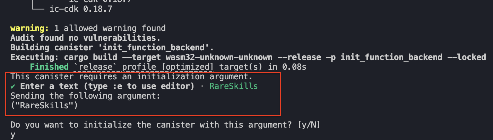
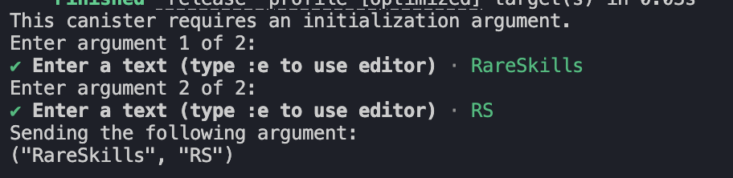

# Initialize State and Canister Upgrades

Constructors are used to initialize smart contract data such as the contract’s owner, admin roles, or token names. Rust canisters define their initialization logic with functions annotated with the `#[ic_cdk::init]` attribute macro:

```rust
// Constructor
#[ic_cdk::init]
fn init() {}
```

The initialization function (`init()`) is executed once, when the canister is deployed. This serves the same role as a Solidity constructor — it runs once when the canister is deployed and sets up the initial state. 

For example, here's a Solidity contract that sets its name during deployment:

```solidity
// SPDX-License-Identifier: MIT
pragma solidity ^0.8.0;

contract MyToken {
    string public name;

    constructor(string memory _name) {
        name = _name;
    }
}
```

Here's the ICP equivalent of the Solidity example:

```rust
use std::cell::RefCell;

thread_local! {
    static NAME: RefCell<String> = RefCell::new(String::new());
}

// Constructor
#[ic_cdk::init]
fn init(name: String) {
    NAME.with(|cell| *cell.borrow_mut() = name);
}

#[ic_cdk::query]
fn name() -> String {
    NAME.with(|cell| cell.borrow().clone())
}
```

The `init()` function accepts a string parameter and stores it in the `NAME` variable, just like the Solidity constructor. We've also included a `name()` query function to read the stored value.

Next, we’ll deploy the canister above to test out the initialization function.

## **Deploy a Canister With The `init()` Function**

Create a new Rust canister project called `init_function`:

```rust
dfx new init_function --type rust --no-frontend
```

Replace `lib.rs` with the canister code below:

```rust
use std::cell::RefCell;

thread_local! {
    static NAME: RefCell<String> = RefCell::new(String::new());
}

// Constructor
#[ic_cdk::init]
fn init(name: String) {
    NAME.with(|cell| *cell.borrow_mut() = name);
}

#[ic_cdk::query]
fn name() -> String {
    NAME.with(|cell| cell.borrow().clone())
}

ic_cdk::export_candid!();
```

Generate the Candid Interface and Deploy the project. dfx will automatically prompt for the `init()` arguments later:

```rust
generate-did init_function_backend
dfx deploy
```

Pass “**RareSkills**” as your string parameter to the initialization argument. Then, type `y` to confirm it.



In the Candid UI, querying `name()` should return `RareSkills`.


## Canister’s Are Upgradeable

ICP canisters are upgradeable. Whenever we re-deploy our canister like how we have been doing, it’s updating the canister’s bytecode as well as its temporary storage and still retains it’s original address.

The effects of re-deploying the canister are two:

1. The Bytecode is upgraded and
2. The canister’s temporary storage is re-set into a clean slate (Canisters have a temporary storage and stable storage, we’ll discuss this shortly).

Since upgrading a contract means that the canister loses it’s previous state, it would mean that the second time we try to re-deploy the canister, our variable would not be initialized. 

## The Initialization Function Only Works During The First Deployment

The initialization function is triggered only for the first time we deploy our canister. Subsequent re-deploys (canister upgrades) would not trigger the initialization function despite the dfx CLI asking prompting us for the initialization arguments. 

To test that the `init()` function wouldn’t work a second time, let’s add another empty string variable `SYMBOL`, and a query function to read it, `symbol()`.

```rust
use std::cell::RefCell;

thread_local! {
    static NAME: RefCell<String> = RefCell::new(String::new());
    // NEW CODE HERE
    static SYMBOL: RefCell<String> = RefCell::new(String::new());
}

#[ic_cdk::init]
fn init(name: String) {
    NAME.with(|cell| *cell.borrow_mut() = name);
}

#[ic_cdk::query]
fn name() -> String {
    NAME.with(|cell| cell.borrow().clone())
}

// NEW CODE HERE
#[ic_cdk::query]
fn symbol() -> String {
    SYMBOL.with(|cell| cell.borrow().clone())
}

ic_cdk::export_candid!();
```

Then in the `init()` function, add the initialization logic for `SYMBOL`. We’re adding a new argument for init, `symbol` and setting it as `SYMBOL`'s value.

```rust
use std::cell::RefCell;

thread_local! {
    static NAME: RefCell<String> = RefCell::new(String::new());
    // NEW CODE HERE
    static SYMBOL: RefCell<String> = RefCell::new(String::new());
}

#[ic_cdk::init]
fn init(name: String, symbol: String) {
    NAME.with(|cell| *cell.borrow_mut() = name);
    
    // SYMBOL's initialization logic
    SYMBOL.with(|cell| *cell.borrow_mut() = symbol);
}

#[ic_cdk::query]
fn name() -> String {
    NAME.with(|cell| cell.borrow().clone())
}

// NEW CODE HERE
#[ic_cdk::query]
fn symbol() -> String {
    SYMBOL.with(|cell| cell.borrow().clone())
}

ic_cdk::export_candid!();
```

Now re-deploy your canister and pass “**RareSkills**” as the first string parameter and “**RS**” as the second.



Query `NAME` and `SYMBOL`, you’ll find that the both their value are empty strings.


The initialization works only for the first time we deploy a canister, upgrading the canister with `dfx deploy` wouldn’t trigger the constructor. However, the initialization logic would work if we **re-install** our canister.

## Re-Install Vs Re-Deploy

From the previous example, we can see that a normal re-deployment (canister upgrade) does not trigger the initialization function. Even though the `dfx` CLI still prompts for initialization arguments, the `init()` function is skipped during upgrades.

To trigger the constructor again, we must **re-install** the canister instead of upgrading it.

So, what’s the difference between upgrading and re-installing a canister?

The difference lies in how the canister’s storage is handled. ICP canisters have two types of storage: **temporary storage** (often called the *heap*) and **stable storage** (also called *stable memory*).

When a canister is upgraded, the canister’s code is replaced, but its stable storage is preserved. The temporary storage, however, is reset. Because the canister is not treated as a fresh installation, the initialization function is not executed again.

In contrast, re-installing a canister completely wipes both the temporary storage and the stable storage. Since all existing state is removed, the canister behaves like a brand-new deployment, and the initialization function is triggered again.

The topic of stable storage is fairly advanced and we do not have to learn it at this point. For now, it’s sufficient to know that normal variables are stored in the temporary storage where their values are re-set across canister upgrades.

For the sake of simplicity when testing out the initialization function, we’ll teach you how to re-install the canister, which the only difference with upgrading a canister is that it wipes out the stable storage.

### Re-install a canister with `dfx`

To re-install a canister, add `—mode=reinstall` to `dfx deploy` like so:

```rust
dfx deploy init_function_backend --mode=reinstall
```

Run the command above and pass “**RareSkills**” and “**RS**” to the initialization arguments again. You’ll find that `NAME` and `SYMBOL` was properly initialized.


To summarize, canister contracts are upgradeable and there are two types of canister upgrades:

1. **Normal upgrade** — does **not** call the initialization function and **preserves stable memory**; the in-memory heap (temporary state where our storage variables are kept) is reset:
    
    ```rust
    dfx deploy <Canister_Name>
    ```
    
2. **Reinstall** — **calls the initialization function again** and **clears both the heap and stable memory**:
    
    ```rust
    dfx deploy <Canister_Name> --mode=reinstall
    ```
    
    Use this command if you are not using the stable storage and you want to trigger the initialization function again.