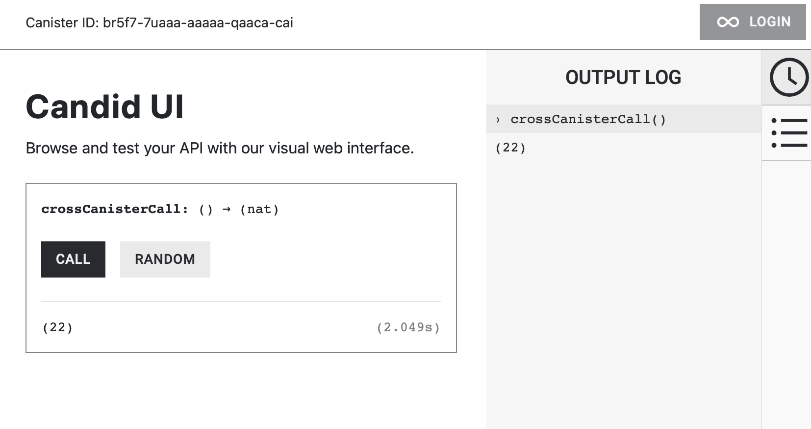

# Cross-Canister Calls and Sending ICP & Cycles from a Canister


In this article, you’ll learn how Canisters can invoke another canister’s function as well as transfer `ICP` and `Cycles`.

### Outline

* **Inter-Canister Function Calls**
* **Transferring `ICP` from a Canister**
* **Transferring `Cycles` from a Canister**

To call another contract function, the target contract needs to be identified beforehand.

For example, in Ethereum cross-contract calls, the target contract’s address, function selectors as well as the parameters to the function and their return value, needs to be identified.

**Solidity contract 1 (Callee)**

```solidity
contract Callee {
    function getNumber() external pure returns (uint) {
        return 42;
    }
}

```

The interface of `Callee` can be imported to the `Caller` contract and the `getNumber()` function called from a `Caller` contract.

**Solidity contract 2 (Caller)**

```solidity
interface ICallee {
    function getNumber() external view returns (uint);
}

contract Caller {
    address contractCallee;

    constructor(address _contractCallee) {
        contractCallee = _contractCallee;
    }

    function callGetNumber() public view returns (uint) {
        return ICallee(contractCallee).getNumber();
    }
}
```

To call another canister’s function, the same logic applies: we need to know the **CanisterID** as well as their **Candid interface**, which tells us how to interact with them.

## Cross-Canister Function Calls

The canister defined below has a public query function named `retVal()` that returns a fixed value of `22`. This will be our `Callee` canister.

```rust
actor Callee {
    public query func retVal() : async Nat {
        return 22;
    };
};
```

To perform a simple cross-canister call, we’ll create a `Caller` canister that invokes the `retVal()` function of the `Callee` canister and returns the result.

### Declaring the `Callee` as the Target Canister

The first step for the `Caller` canister is to define the `Callee` [Actor Type](https://internetcomputer.org/docs/current/motoko/main/writing-motoko/actors-async#actor-types). This is similar to declaring a Solidity Contract Interface, except that it is declared within the Actor scope.

**Caller Canister**

```jsx
actor Caller {
		// Define target Canister
    type Callee = actor {
        retVal : () -> async Nat;
    };
};
```

Next, we’ll define a variable that references the `Callee` actor by specifying its `CanisterID` and assigning it the `Callee` type.

**Caller**

```jsx
actor Caller {

		// Define target Canister type
    type Callee = actor {
        retVal : () -> async Nat;
    };
		
		//
    let callee = actor ("bkyz2-fmaaa-aaaaa-qaaaq-cai") : Callee;
};
```

With this setup, the `Caller` canister has a reference to the `Callee` canister, allowing it to call its `retVal()` function through the `callee` actor variable.

### Invoking the `Callee` Canister Function

Finally we’ll invoke the `retVal()` method of the `Callee` canister from the `Caller` function: `crossCanisterCall()`.

```jsx
actor Caller {
    type Callee = actor {
        retVal : () -> async Nat;
    };

    let callee = actor ("bkyz2-fmaaa-aaaaa-qaaaq-cai") : Callee;

    public func crossCansiterCall() : async Nat {
        return await callee.retVal();
    };
};
```

Head over to the `Candid UI` of the `Caller canister` to test it, it should return the expected value of **22**!



### Passing arguments to the cross-canister call

The example above only shows how we can invoke another canister’s function and handle the return value. In this example, we’ll show how to pass arguments to the cross-canister function.

Within the `Calle` canister below, we have a function that accepts two natural numbers and returns their total sum.

**Callee**

```jsx
actor Callee {
    public func add(x : Nat, y : Nat) : async Nat {
        return x + y;
    };
};
```

We’ll define the `Callee` canister type, create a variable that reference the `Callee Actor` and call the `add()` function.

**Caller**

```jsx
actor Caller {
    type Callee = actor {
        add : (Nat, Nat) -> async Nat;
    };

    let callee = actor ("bkyz2-fmaaa-aaaaa-qaaaq-cai") : Callee;

    public func passArguments(x : Nat, y : Nat) : async Nat {
        return await callee.add(x, y);
    };
};
```

If you observe, when declaring the actor type, its the function parameters are- both natural numbers, which represents the expected arguments.

### Cross-canister calls as foundation for transferring `ICP` and `Cycles`

The `ICP` Token is implemented as a Canister smart contract called the **ICP Ledger Canister**. Hence to transfer `ICP` Tokens you are effectively calling the `transfer()` function of the ICP Ledger Canister, which is a cross-canister call.

Transferring `Cycles` to another canister involves forwarding the `cycles` within the Callee Canister function call, hence also a cross-canister call.

## Transferring `ICP` from a Canister

You’ll need to top-up your `Caller` Canister with ICP Tokens to be able to perform the transfer to an EOA or another Canister.

### Declaring and Referencing the ICP Ledger Canister

As transferring an ICP token resembles an ERC20 token transfer, we’ll simply have our `Caller` Canister invoke the `transfer()` function of the **ICP Ledger Canister** from our Canister.

Define the **ICP Ledger** actor type and include only the `transfer` function. Then, create a reference to the **ICP Ledger** canister with its **Canister ID** and type, to allow the **Caller** canister to invoke its `transfer()` method.

**Caller Canister**

```rust
actor Caller {

    // Define the ICP Ledger type
    type Ledger = actor {
        transfer : (
            {
                from_subaccount : ?[Nat8];
                to : Text;
                amount : Nat;
                fee : Nat;
                memo : Nat64;
                created_at_time : ?Nat64;
            },
        ) -> async { Ok : Nat; Err : Text };
    };

    // Create a reference to the ICP Ledger canister
    let ledger = actor ("ryjl3-tyaaa-aaaaa-aaaba-cai") : Ledger;
};

```

### Calling the Ledger `transfer()` Function

Finally, we’ll invoke the `transfer()` function of the **Ledger** canister to initiate a token transfer.

**Caller Canister**

```jsx
actor Caller {
    // Define the ICP Ledger type
    type Ledger = actor {
        transfer : (
            {
                from_subaccount : ?[Nat8];
                to : Text;
                amount : Nat;
                fee : Nat;
                memo : Nat64;
                created_at_time : ?Nat64;
            },
        ) -> async { Ok : Nat; Err : Text };
    };

    // Create a reference to the ICP Ledger canister
    let ledger = actor ("ryjl3-tyaaa-aaaaa-aaaba-cai") : Ledger;
    
    public func transferICP(to: Text, amount: Nat) : async { 
		    Ok: Nat; 
		    Err: Text 
		} {
        return await ledger.transfer({
            from_subaccount = null;
            to = to;
            amount = amount;
            fee = 10_000;  // Standard transfer fee
            memo = 0;
            created_at_time = null;
        });
    };
}

```

By calling the `transferICP()` function of the **Caller** canister, you can initiate an ICP token transfer to another canister or an Externally Owned Account (EOA).

## Transferring `Cycles` from a Canister

Fundamentally, cycles can only be transferred between canisters, never an EOA. An EOA can hold cycles by owning a **Cycle Wallet** (Owning a Canister to hold cycles in behalf of the EOA) or through the **Cycles Ledger** (A global ledger like the ICP Ledger, except that it tracks Cycles).

This section will be heavily used in **Chain Fusion Technology** as their services are paid in cycles.

### Using the `ExperimentalCycles` Library to transfer Cycles to a Canister

With the `ExperimentalCycles` library, to transfer `cycles`, it needs to be forwarded within a function call. Which means the `cycles` to be transferred is attached during the cross-canister call of the target canister. Its like sending mail, you can only input money inside the envelope(the function call), and not the money itself.

The `receiver` below has the function `acceptCycles()` that accepts `cycles` forwarded by the `sender` and returns the number of `cycles` accepted.

**Receiver**

```rust
import Cycles "mo:base/ExperimentalCycles";

actor Receiver {

    // Function to accept cycles
    public func acceptCycles() : async Nat {
        return Cycles.accept<system>(Cycles.available());
    }
}
```

If the function **does not** explicitly use **`Cycles.accept()`**, it will **not be able to accept cycles**. The default behavior of a canister is to reject any incoming cycles unless you explicitly handle them using `Cycles.accept`.

Declare the `Receiver` actor type that the `Sender` is forwarding `Cycles` to.

**Sender**

```jsx
import Cycles "mo:base/ExperimentalCycles";

actor Sender {

    // Define the target canister type
    type Receiver = actor {
        acceptCycles: () -> async Nat;
    };
}

```

Next, create a variable that references the `Receiver` **canister** and assign it the `receiver` actor type.

**Caller**

```jsx
import Cycles "mo:base/ExperimentalCycles";

actor Sender {

    // Define the target canister type
    type Receiver = actor {
        acceptCycles: () -> async Nat;
    };

    // Reference the target canister by its Canister ID
    let receiver = actor ("bkyz2-fmaaa-aaaaa-qaaaq-cai") : Callee;
}

```

To transfer cycles, we will create a function called `transferCycles()` that prepares the cycles to be sent using the **ExperimentalCycles** library, and then calls the `acceptCycles()` function on the target canister.

**Caller**

```jsx
import Cycles "mo:base/ExperimentalCycles";

actor Sender {

    type Receiver = actor {
        acceptCycles: () -> async Nat;
    };

    let receiver = actor ("bkyz2-fmaaa-aaaaa-qaaaq-cai") : Receiver;

    // Function to send cycles to the target canister
    public func transferCycles(amount: Nat) : async Nat {
        // Add the amount of cycles to be sent
        Cycles.add<system>(amount);

        // Call the acceptCycles function of the target canister
        return await receiver.acceptCycles();
    };
}

```

**Function** `TransferCycles()` **Explanation:**

* The line `Cycles.add<system>(amount)` prepares the specified amount of cycles to be transferred in the next canister call.
* Invoking the `acceptCycles()` function on the `Callee` Canister \*\*\*\*`effectively` transfers the prepared cycles attached to the function call.
* The return value will be the amount of cycles that the `Callee` Canister actually accepted

This method can be used to send `cycles` to other canisters or to a **cycles wallet**.
