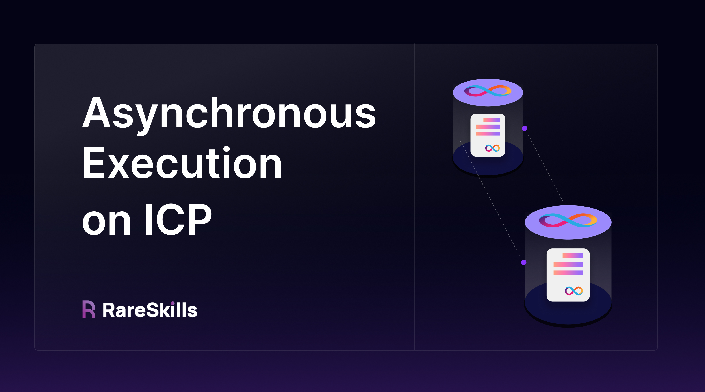

# Asynchronous Execution on ICP



In this tutorial, we'll explore how asynchronous execution works in ICP and understand its nuances through practical examples. All canisters communicate asynchronously with external Accounts or Canister. This is due to how Canisters are designed, which is based on the actor model.

### Actor Model

The **actor model** is a conceptual framework for building concurrent, distributed systems where **actors** are the fundamental units of computation. 

Each actor is an isolated, self-contained unit with its own state, which can only be modified by the actor itself, preventing shared state conflicts. 

Actors communicate through asynchronous messaging, allowing independent operation and avoiding data races or deadlocks. Concurrency is achieved by isolating state within each actor and processing messages sequentially. 

The **Internet Computer** adopts this model via **canisters**, which act like actors by maintaining private state and using asynchronous message-passing for interaction, ensuring atomic and safe concurrent operations across decentralized applications. 

Code within canisters executes synchronously; only inter-canister calls and external computations are asynchronous.

## **Understanding Asynchronous Execution Caveats**

Suppose **Canister 1** makes a call to **Canister 2** to perform a state update. After initiating this call to **Canister 2** successfully, **Canister 1** may perform additional operations. Here’s where it gets interesting: if an error occurs *after* the inter-canister call to Canister 2, those subsequent operations may fail, but **the state change in Canister 2 won’t revert**. This is because, in the ICP model, each canister call is independent, and once a message is sent, there is no built-in guarantee that other operations will "roll back" if the calling canister encounters an error.

### **Example: Inter-Canister Call and State Inconsistency**

Consider the following code where **Canister 1** increments a local state variable and then calls **Canister 2** to increment its variable asynchronously. If an error occurs in **Canister 1** after calling **Canister 2**, the state changes in **Canister 1** revert, but the state change in **Canister 2** does not.

**Canister 1**:

`Motoko`

```jsx
actor Canister1 {
    var stateVar : Nat = 0;

    public func incrementBoth() : async () {
        // Step 1: Increment a local variable in Canister1.
        stateVar += 1;

        // Step 2: Send a message to increment a variable in Canister2.
        let result = await Canister2.increment();

        // Step 3: Perform additional state change (which fails).
        if (stateVar > 0) { // Assuming this condition somehow causes an error
            throw Error("Failed to complete the operation.");
        }
    }
}
```

`Rust`

```rust
use candid::Nat;
use ic_cdk::call;
use std::cell::RefCell;

// State variable
thread_local! {
    static STATE_VAR: RefCell<Nat> = RefCell::new(Nat::from(0 as u64));
}

#[ic_cdk::update]
async fn increment_both() -> Result<(), String> {
    // Step 1: Increment local variable in Canister1
    STATE_VAR.with(|state| {
        let current = state.borrow().clone();
        *state.borrow_mut() = current + Nat::from(1 as u64);
    });

    // Step 2: Send message to increment variable in Canister2
    // Replace with actual Canister2 ID
    let canister2_id = ic_cdk::export::Principal::from_text("aaaaa-aa")
        .map_err(|e| format!("Invalid principal: {}", e))?;

    // Make inter-canister call
    let _: Result<(), _> = call(canister2_id, "increment", ()).await
        .map_err(|e| format!("Failed to call Canister2: {:?}", e))?;

    // Step 3: Perform additional state change (which fails)
    STATE_VAR.with(|state| {
        if *state.borrow() > Nat::from(0 as u64) {
            return Err("Failed to complete the operation.".to_string());
        }
        Ok(())
    })
}
```

**Canister 2**:

`Motoko`

```jsx
actor Canister2 {
    var externalState : Nat = 0;

    public func increment() : async () {
        // This state change will not revert if Canister1 later fails.
        externalState += 1;
    }
}
```

`Rust`

```rust
use candid::Nat;
use std::cell::RefCell;

// External state variable
thread_local! {
    static EXTERNAL_STATE: RefCell<Nat> = RefCell::new(Nat::from(0 as u64));
}

#[ic_cdk::update]
async fn increment() {
    EXTERNAL_STATE.with(|state| {
        let current = state.borrow().clone();
        *state.borrow_mut() = current + Nat::from(1 as u64);
    });
}

// Export the Candid interface
candid::export_service!();
```

In this example:

- `Canister1` increments its own `stateVar` and then calls the `increment` function in `Canister2` to update `externalState`.
- If an error occurs in `Canister1` after calling `increment`, the state changes in `Canister1` revert, but the state change in `Canister2` does not revert.

This illustrates that each inter-canister call is isolated and cannot be rolled back by the calling canister if an error occurs later on.

## **State Changes in ICP**

State changes in ICP canisters are transactional within each canister. When a canister sends an asynchronous message, the action is queued and executed by the target canister. Once an inter-canister call completes, its state is finalized, which means subsequent operations in the calling canister cannot "revert" previously completed actions in the called canister.

To learn more about handling asynchronous execution on ICP, refer to the [official ICP developer documentation on asynchronous programming](https://internetcomputer.org/docs/current/developer-docs/design/how-it-works-asynchronous/).

- [Security Best Practices: Inter-Canister Calls](https://internetcomputer.org/docs/current/developer-docs/security/security-best-practices/inter-canister-calls)