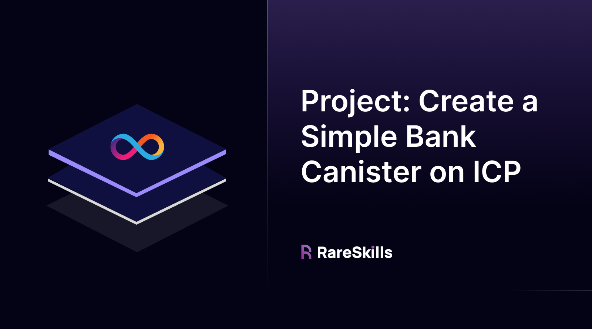

# Project: Create a Simple Bank Canister on ICP



For this project, we will build a canister that simulates a bank or a vault for depositing and withdrawing the `ICP` tokens. To achieve this, we’ll use the `Approve-Transfer-From` pattern, which allows a user(owner) to delegate tokens to our canister (spender) to transfer `ICP` tokens on their behalf.

### **Motivation for the `Approve-Transfer-From` Pattern**

Since canisters cannot detect `ICP` token transfers automatically, we need to use a well-known approach called the Approve-Transfer-From Pattern.

**Approve**: The user gives permission for the bank canister to transfer a specified amount of ICP tokens on their behalf.

**Transfer-From**: The canister then moves the user’s tokens to its own account, which it can verify the transaction.

The `deposit` function will handle the `Transfer-From` call, and the `withdraw` function will send ICP tokens back to the user.

## **Approve the Bank Canister as a Spender using `icrc2_approve`**

The user must first approve the canister to act as a delegate. Here’s an `Agent.js` script that invokes the `icrc2_approve`function:

```jsx
import { Ed25519KeyIdentity } from "@dfinity/identity";
import { HttpAgent, Actor } from "@dfinity/agent";

const privateKey = Uint8Array.from(Buffer.from(privateKeyHex, "hex"));
const publicKeyDer = Uint8Array.from(Buffer.from(publicKeyDerHex, "hex"));

const identity = Ed25519KeyIdentity.fromKeyPair(publicKeyDer, privateKey); // Create the identity from keys
const agent = await HttpAgent.create({ identity }); // Create HTTP agent

console.log("Identity created successfully");

// Ledger canister ID and actor creation
const ledgerCanisterId = "ryjl3-tyaaa-aaaaa-aaaba-cai"; // Main ledger canister ID
const idlFactory = await fetchCandid("ryjl3-tyaaa-aaaaa-aaaba-cai", agent)

const actor = Actor.createActor(idlFactory, {
    agent,
    canisterId: ledgerCanisterId,
});

// Call the icrc2_approve method on the token canister
const result = await tokenActor.icrc2_approve({
    fee: [FEE_E8S], // 10_000 e8s fee
    memo: null,
    from_subaccount: fromSubAccount,
    created_at_time: null,
    amount: BigInt(amount),
    expected_allowance: null,
    expires_at: expiresAt,
    spender: { owner: BANK_CANISTER_ID, subaccount: null }, // Bank Canister as spender
});

if ("Ok" in result) {
    console.log(`Approval successful: ${amount} tokens approved for Bank Canister.`);
} else {
    console.error("Approval failed:", result.Err);
}
```

Once approval is granted, the canister has the right to use the tokens for the `deposit` function.

## **Deposit ICP Tokens to the Bank Canister**

Before we even deposit, we’ll need a data structure that can map principal/addresses to a number that represents their bank balance. For this, we can use the HashMap DS.

`Motoko`

```jsx
import Principal "mo:base/Principal";
import HashMap "mo:base/HashMap";
import Debug "mo:base/Debug";

actor SimpleBankVault {

  let balances = HashMap.HashMap<Principal, Nat>(5, Principal.equal, Principal.hash);

	 // Public function to check the user's balance
  public func getBalance(user: Principal) : async ?Nat {
    return balances.get(user);
  }
}
```

`Rust`

```rust
use candid::{Nat, Principal};
use ic_cdk::api::caller;
use std::cell::RefCell;
use std::collections::HashMap;

thread_local! {
    static BALANCES: RefCell<HashMap<Principal, Nat>> = RefCell::new(HashMap::new());
}

// Public function to check the user's balance
#[ic_cdk::query]
fn get_balance(user: Principal) -> Option<Nat> {
    BALANCES.with(|balances| {
        balances.borrow().get(&user).cloned()
    })
}
```

This is almost equivalent to the solidity mapping of address to uint256.

Next we’ll create a function that can read and add the balance of a principal.

`Motoko`

```jsx
import Principal "mo:base/Principal";
import HashMap "mo:base/HashMap";
import Debug "mo:base/Debug";

actor SimpleBankVault {

  let balances = HashMap.HashMap<Principal, Nat>(5, Principal.equal, Principal.hash);

  // Deposit function
  public shared(msg) func deposit(user: Principal, amount: Nat) : async Bool {
	  assert(msg.caller == user);
	  let currentBalance = switch (balances.get(user)) {
      case null 0;
      case (?balance) balance;
    };
    balances.put(user, currentBalance + amount); // Update user's balance
    Debug.print("Deposit successful.");
    return true;
  };

  // Public function to check the user's balance
  public func getBalance(user: Principal) : async ?Nat {
    return balances.get(user);
  }
}
```

`Rust`

```rust
use candid::{Nat, Principal};
use ic_cdk::api::caller;
use std::cell::RefCell;
use std::collections::HashMap;

// Define the state structure
thread_local! {
    static BALANCES: RefCell<HashMap<Principal, Nat>> = RefCell::new(HashMap::new());
}

// Deposit function
#[ic_cdk::update]
fn deposit(user: Principal, amount: Nat) -> bool {
    // Verify the caller is the same as the user
    let caller = caller();
    assert!(
        caller == user,
        "Caller must be the same as the user"
    );

    BALANCES.with(|balances| {
        let mut balances = balances.borrow_mut();
        // Get current balance or default to 0
        let current_balance = balances
            .get(&user)
            .cloned()
            .unwrap_or_else(|| Nat::from(0 as u64));
        
        // Update the balance
        balances.insert(user, current_balance + amount);
    });

    ic_cdk::println!("Deposit successful.");
    true
}

// Query function to get balance
#[ic_cdk::query]
fn get_balance(user: Principal) -> Option<Nat> {
    BALANCES.with(|balances| {
        balances.borrow().get(&user).cloned()
    })
}
```

The `deposit` function initiates a transfer from the user to the canister using the `icrc2_transferfrom` method. Next, we’ll need to invoke it in the deposit function. But before that we’ll have to declare and reference the ICP Ledger Canister.

`Motoko`

```jsx
import Principal "mo:base/Principal";
import HashMap "mo:base/HashMap";
import Debug "mo:base/Debug";

actor SimpleBankVault {

  //icrc2_transferfrom and transfer functions
  type Ledger = actor {
      icrc2_transferfrom : (
          {
              from_subaccount : ?[Nat8];
              to : Principal;
              amount : Nat;
              fee : Nat;
              memo : Nat64;
              created_at_time : ?Nat64;
              spender : Principal;
          }
      ) -> async { Ok : Nat; Err : Text };

      transfer : (
          {
              from_subaccount : ?[Nat8];
              to : Principal;
              amount : Nat;
              fee : Nat;
              memo : Nat64;
              created_at_time : ?Nat64;
          }
      ) -> async { Ok : Nat; Err : Text };
  };
  
  let ledger = actor("ryjl3-tyaaa-aaaaa-aaaba-cai") : Ledger;

  let balances = HashMap.HashMap<Principal, Nat>(5, Principal.equal, Principal.hash);

  // Deposit function
  public shared(msg) func deposit(user: Principal, amount: Nat) : async Bool {

		assert(user == msg.caller);
		
	  let currentBalance = switch (balances.get(user)) {
	    case null 0;
	    case (?balance) balance;
	  };
	  
	  balances.put(user, currentBalance + amount); // Update user's balance
	  Debug.print("Deposit successful.");
	  return true;
 
  };

  // Public function to check the user's balance
  public func getBalance(user: Principal) : async ?Nat {
    return balances.get(user);
  }
}
```

`Rust`

```rust
use candid::{Nat, Principal};
use ic_cdk::api::caller;
use std::cell::RefCell;
use std::collections::HashMap;

// Define the state structure
thread_local! {
    static BALANCES: RefCell<HashMap<Principal, Nat>> = RefCell::new(HashMap::new());
}

#[derive(CandidType, Deserialize)]
struct Account {
    owner: Principal,
    subaccount: Option<Vec<u8>>,
}

#[derive(CandidType)]
struct TransferFromArgs {
    from: Account,
    to: Account, 
    amount: Nat,
    fee: Nat,
    spender_subaccount: Option<Vec<u8>>,
    memo: Option<Vec<u8>>,
    created_at_time: Option<u64>,
}

#[derive(CandidType, Deserialize)]
enum TransferFromResult {
    Ok(Nat),
    Err(String),
}

// Deposit function
#[ic_cdk::update]
fn deposit(user: Principal, amount: Nat) -> bool {
    // Verify the caller is the same as the user
    let caller = caller();
    assert!(
        caller == user,
        "Caller must be the same as the user"
    );
    
    // ICP Ledger canister ID
    let ledger_principal = Principal::from_text("ryjl3-tyaaa-aaaaa-aaaba-cai")
        .expect("Failed to parse ledger principal");

    let transfer_args = TransferFromArgs {
        from,
        to,
        amount,
        fee: Nat::from(10_000u32),
        spender_subaccount: None,
        memo: None,
        created_at_time: None,
    };

    BALANCES.with(|balances| {
        let mut balances = balances.borrow_mut();
        // Get current balance or default to 0
        let current_balance = balances
            .get(&user)
            .cloned()
            .unwrap_or_else(|| Nat::from(0 as u64));
        
        // Update the balance
        balances.insert(user, current_balance + amount);
    });

    ic_cdk::println!("Deposit successful.");
    true
}

// Query function to get balance
#[ic_cdk::query]
fn get_balance(user: Principal) -> Option<Nat> {
    BALANCES.with(|balances| {
        balances.borrow().get(&user).cloned()
    })
}
```

Invoke the `icrc2_transferfrom` function within the `Deposit` function.

`Motoko`

```jsx
import Principal "mo:base/Principal";
import HashMap "mo:base/HashMap";
import Debug "mo:base/Debug";

actor SimpleBankVault {

  // Define the ICP Ledger type with both `icrc2_transferfrom` and `transfer` functions
  type Ledger = actor {
      icrc2_transferfrom : (
          {
              from_subaccount : ?[Nat8];
              to : Principal;
              amount : Nat;
              fee : Nat;
              memo : Nat64;
              created_at_time : ?Nat64;
              spender : Principal;
          }
      ) -> async { Ok : Nat; Err : Text };

      transfer : (
          {
              from_subaccount : ?[Nat8];
              to : Principal;
              amount : Nat;
              fee : Nat;
              memo : Nat64;
              created_at_time : ?Nat64;
          }
      ) -> async { Ok : Nat; Err : Text };
  };

  // Reference to the ICP Ledger canister
  let ledger = actor("ryjl3-tyaaa-aaaaa-aaaba-cai") : Ledger;

  // HashMap to track each user's balance
  let balances = HashMap.HashMap<Principal, Nat>(5, Principal.equal, Principal.hash);

  // Deposit function: Uses `icrc2_transferfrom` to transfer tokens from the user to the canister
  public shared(msg) func deposit(user: Principal, amount: Nat) : async Bool {

    assert(user == msg.caller);

    let transferResult = await ledger.icrc2_transferfrom({
        from_subaccount = null;                      
        to = Principal.fromActor(SimpleBankVault);   
        amount = amount;                             
        fee = 10_000;                                
        memo = 0;                                    
        created_at_time = null;                      
        spender = user;                              
    });

    if (transferResult.Ok > 0) {
        let currentBalance = switch (balances.get(user)) {
          case null 0;
          case (?balance) balance;
        };
        balances.put(user, currentBalance + amount); // Update user's balance
        Debug.print("Deposit successful.");
        return true;
    } else {
        Debug.print("Deposit failed with error: " # transferResult.Err);
        return false;
    }
  };

  
  // Public function to check the user's balance
  public func getBalance(user: Principal) : async ?Nat {
    return balances.get(user);
  }
}
```

`Rust`

```rust
use candid::{Nat, Principal};
use ic_cdk::call;
use std::cell::RefCell;
use std::collections::HashMap;

// Define transfer argument structures
#[derive(candid::CandidType)]
struct TransferArgs {
    memo: u64,
    amount: Nat,
    fee: Nat,
    from_subaccount: Option<[u8; 32]>,
    to: Principal,
    created_at_time: Option<u64>,
}

#[derive(candid::CandidType)]
struct TransferFromArgs {
    memo: u64,
    amount: Nat,
    fee: Nat,
    from_subaccount: Option<[u8; 32]>,
    to: Principal,
    created_at_time: Option<u64>,
    spender: Principal,
}

thread_local! {
    static BALANCES: RefCell<HashMap<Principal, Nat>> = RefCell::new(HashMap::new());
}

#[ic_cdk::update]
async fn deposit(user: Principal, amount: Nat) -> Result<bool, String> {
    // Verify the caller is the same as the user
    let caller = ic_cdk::api::caller();
    assert!(
        caller == user,
        "Caller must be the same as the user"
    );

    // ICP Ledger canister ID
    let ledger_principal = Principal::from_text("ryjl3-tyaaa-aaaaa-aaaba-cai")
        .map_err(|e| format!("Failed to parse principal: {}", e))?;

    // Clone amount before using it in transfer_args
    let amount_clone = amount.clone();
    let transfer_args = TransferFromArgs {
        from_subaccount: None,
        to: ic_cdk::api::id(),
        amount,
        fee: Nat::from(10_000u32),
        memo: 0,
        created_at_time: None,
        spender: user,
    };

    // Make the transfer call
    let call_result: Result<(Nat,), _> = call(
        ledger_principal,
        "icrc2_transfer_from",
        (transfer_args,),
    ).await;

    match call_result {
        Ok((block_index,)) => {
            BALANCES.with(|balances| {
                let mut balances = balances.borrow_mut();
                let current_balance = balances
                    .get(&user)
                    .cloned()
                    .unwrap_or_else(|| Nat::from(0u64));
                
                balances.insert(user, current_balance + amount_clone);
            });

            ic_cdk::println!("Deposit successful.");
            Ok(true)
        },
        Err((code, msg)) => {
            Err(format!(
                "Inter-canister call failed with code {:?}: {}",
                code, msg
            ))
        }
    }
}

#[ic_cdk::query]
fn get_balance(user: Principal) -> Option<Nat> {
    BALANCES.with(|balances| {
        balances.borrow().get(&user).cloned()
    })
}
```

### **Withdraw ICP Tokens from the Bank Vault**

The `withdraw` function transfers the user’s available ICP tokens from the canister back to the user. It verifies the balance, deducts the amount, and initiates the transfer:

`Motoko`

```solidity
import Principal "mo:base/Principal";
import HashMap "mo:base/HashMap";
import Debug "mo:base/Debug";

actor SimpleBankVault {

  // Define the ICP Ledger type with both `icrc2_transferfrom` and `transfer` functions
  type Ledger = actor {
      icrc2_transferfrom : (
          {
              from_subaccount : ?[Nat8];
              to : Principal;
              amount : Nat;
              fee : Nat;
              memo : Nat64;
              created_at_time : ?Nat64;
              spender : Principal;
          }
      ) -> async { Ok : Nat; Err : Text };

      transfer : (
          {
              from_subaccount : ?[Nat8];
              to : Principal;
              amount : Nat;
              fee : Nat;
              memo : Nat64;
              created_at_time : ?Nat64;
          }
      ) -> async { Ok : Nat; Err : Text };
  };

  // Reference to the ICP Ledger canister
  let ledger = actor("ryjl3-tyaaa-aaaaa-aaaba-cai") : Ledger;

  // HashMap to track each user's balance
  let balances = HashMap.HashMap<Principal, Nat>(5, Principal.equal, Principal.hash);

  // Deposit function: Uses `icrc2_transferfrom` to transfer tokens from the user to the canister
  public shared(msg) func deposit(user: Principal, amount: Nat) : async Bool {

    assert(user == msg.caller);

    let transferResult = await ledger.icrc2_transferfrom({
        from_subaccount = null;                      
        to = Principal.fromActor(SimpleBankVault);   
        amount = amount;                             
        fee = 10_000;                                
        memo = 0;                                    
        created_at_time = null;                      
        spender = user;                              
    });

    if (transferResult.Ok > 0) {
        let currentBalance = switch (balances.get(user)) {
          case null 0;
          case (?balance) balance;
        };
        balances.put(user, currentBalance + amount); // Update user's balance
        Debug.print("Deposit successful.");
        return true;
    } else {
        Debug.print("Deposit failed with error: " # transferResult.Err);
        return false;
    }
  };

  // Withdraw function: Uses `transfer` to send the entire balance back to the user
  public shared(msg) func withdraw(user: Principal) : async Bool {
    
    assert(user == msg.caller);

    // Retrieve the user's balance
    let currentBalance = switch (balances.get(user)) {
      case null 0;
      case (?balance) balance;
    };

    if (currentBalance > 0) {
      // Attempt to transfer the entire balance back to the user using `transfer`
      let transferResult = await ledger.transfer({
          from_subaccount = null;                      
          to = user;                                  
          amount = currentBalance;                    
          fee = 10_000;                              
          memo = 0;                                   
          created_at_time = null;                     
      });

      if (transferResult.Ok > 0) {
          balances.put(user, 0); // Set user's balance to zero after withdrawal
          Debug.print("Withdrawal successful.");
          return true;
      } else {
          Debug.print("Withdrawal failed with error: " # transferResult.Err);
          return false;
      }
    } else {
      Debug.print("Insufficient balance for withdrawal.");
      return false;
    }
  };

  // Public function to check the user's balance
  public func getBalance(user: Principal) : async ?Nat {
    return balances.get(user);
  }
}

```

`Rust`

```rust
use candid::{Nat, Principal};
use ic_cdk::call;
use std::cell::RefCell;
use std::collections::HashMap;

// Define transfer argument structures
#[derive(candid::CandidType)]
struct TransferArgs {
    memo: u64,
    amount: Nat,
    fee: Nat,
    from_subaccount: Option<[u8; 32]>,
    to: Principal,
    created_at_time: Option<u64>,
}

#[derive(candid::CandidType)]
struct TransferFromArgs {
    memo: u64,
    amount: Nat,
    fee: Nat,
    from_subaccount: Option<[u8; 32]>,
    to: Principal,
    created_at_time: Option<u64>,
    spender: Principal,
}

thread_local! {
    static BALANCES: RefCell<HashMap<Principal, Nat>> = RefCell::new(HashMap::new());
}

#[ic_cdk::update]
async fn deposit(user: Principal, amount: Nat) -> Result<bool, String> {
    // Verify the caller is the same as the user
    let caller = ic_cdk::api::caller();
    assert!(
        caller == user,
        "Caller must be the same as the user"
    );

    // ICP Ledger canister ID
    let ledger_principal = Principal::from_text("ryjl3-tyaaa-aaaaa-aaaba-cai")
        .map_err(|e| format!("Failed to parse principal: {}", e))?;

    // Clone amount before using it in transfer_args
    let amount_clone = amount.clone();
    let transfer_args = TransferFromArgs {
        from_subaccount: None,
        to: ic_cdk::api::id(),
        amount,
        fee: Nat::from(10_000u32),
        memo: 0,
        created_at_time: None,
        spender: user,
    };

    // Make the transfer call
    let call_result: Result<(Nat,), _> = call(
        ledger_principal,
        "icrc2_transfer_from",
        (transfer_args,),
    ).await;

    match call_result {
        Ok((block_index,)) => {
            BALANCES.with(|balances| {
                let mut balances = balances.borrow_mut();
                let current_balance = balances
                    .get(&user)
                    .cloned()
                    .unwrap_or_else(|| Nat::from(0u64));
                
                balances.insert(user, current_balance + amount_clone);
            });

            ic_cdk::println!("Deposit successful.");
            Ok(true)
        },
        Err((code, msg)) => {
            Err(format!(
                "Inter-canister call failed with code {:?}: {}",
                code, msg
            ))
        }
    }
}

#[ic_cdk::update]
async fn withdraw(user: Principal) -> Result<bool, String> {
    // Verify the caller is the same as the user
    let caller = ic_cdk::api::caller();
    assert!(
        caller == user,
        "Caller must be the same as the user"
    );

    // Get current balance
    let current_balance = BALANCES.with(|balances| {
        balances.borrow().get(&user).cloned().unwrap_or_else(|| Nat::from(0u64))
    });

    // Check if balance is greater than 0
    if current_balance == Nat::from(0u64) {
        return Err("Insufficient balance for withdrawal.".to_string());
    }

    // ICP Ledger canister ID
    let ledger_principal = Principal::from_text("ryjl3-tyaaa-aaaaa-aaaba-cai")
        .map_err(|e| format!("Failed to parse principal: {}", e))?;

    let transfer_args = TransferArgs {
        from_subaccount: None,
        to: user,
        amount: current_balance,
        fee: Nat::from(10_000u32),
        memo: 0,
        created_at_time: None,
    };

    // Make the transfer call
    let call_result: Result<(Nat,), _> = call(
        ledger_principal,
        "transfer",
        (transfer_args,),
    ).await;

    match call_result {
        Ok((block_index,)) => {
            // Set balance to zero after successful withdrawal
            BALANCES.with(|balances| {
                balances.borrow_mut().insert(user, Nat::from(0u64));
            });

            ic_cdk::println!("Withdrawal successful.");
            Ok(true)
        },
        Err((code, msg)) => {
            Err(format!(
                "Inter-canister call failed with code {:?}: {}",
                code, msg
            ))
        }
    }
}

#[ic_cdk::query]
fn get_balance(user: Principal) -> Option<Nat> {
    BALANCES.with(|balances| {
        balances.borrow().get(&user).cloned()
    })
}
```

The withdraw function securely transfers the tokens back to the user and updates their balance accordingly. That’s it! You’ve just made a Simple Vault capable of depositing and withdrawing ICP Tokens.