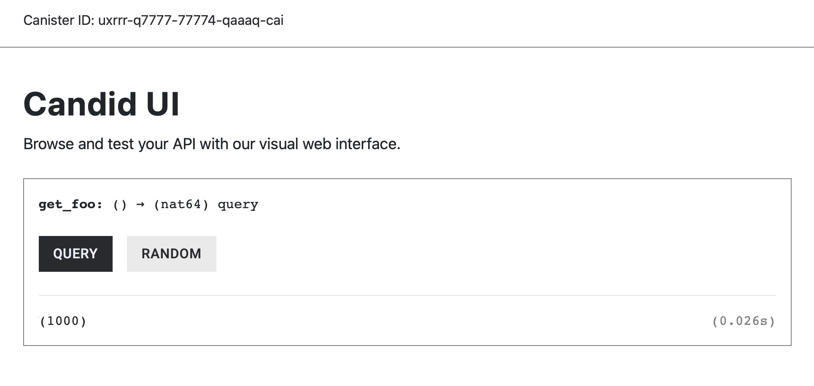
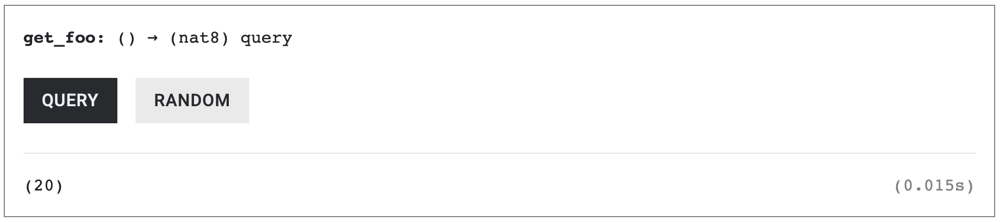
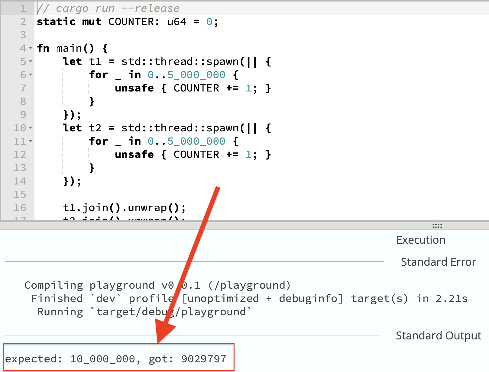

# State/Storage Variables

Rust provides three keywords for declaring variables and their scope: **`let`**, **`const`**, and **`static`**. In ICP canisters, the `static` keyword is used to declare a state/storage variable that persists its data on the ICP blockchain.

### The `let` keyword

**`let`** creates a local variable whose lifetime ends when it goes out of scope. This keyword is often used within functions.

```rust
fn bar() {
		let local_variable = 20;
}
```

### The `const` keyword

**`const`** defines a constant variable whose value is inlined directly into the bytecode. We use this to declare a global or local constant.

```rust
// global scope
const GLOBAL_CONSTANT : bool = true;

fn bar() {
		// local scope
		let local_variable = 20;
		const local_constant = 20;
}
```

**Note:** Naming conventions for Rust global variables uses `UPPER_SNAKE_CASE`**.**

### The `static` keyword declares a State Variable

**`static`** defines a global state variable with a single memory location shared across the entire program. We use the `static` keyword to define a **state/storage** **variable**, for example:

```rust
// global scope

// state/storage variable
static STATE_VARIABLE: u8 = 20;

// constant variable
const GLOBAL_CONSTANT: bool = true;

// some function
fn bar() {
		// local scope
		let local_variable = 20;
		const local_constant = 20;
}
```

In normal Rust, `static` variables exist only for the lifetime of the program and get discarded when the program ends. However, ICP does extra work behind the scenes to persist a `static` variable’s value in the blockchain.

### `Static` Variables Mutability

`static` variables are **immutable** by default, meaning their value cannot change once the canister is deployed. The `static` variable `X` below will store its value in the storage, but it cannot be mutated.

```rust
// Immutable State Variable
static X: u8 = 20;
```

To make a `static` variable **mutable** at runtime, the `mut` keyword must be explicitly added after the `static` keyword. `static mut Y`'s value will be kept in the storage, and it can be mutated.

```rust
// Add the MUT keyword to Static to make it mutable
static mut Y: u8 = 20;
```

*The use of `static mut` to declare mutable state variables is **unsafe**. *****However, we will still introduce it as it is foundational knowledge that builds upon the recommended way to declare mutable `static` variables.

Before we begin working with mutable variables, let’s first learn how to query an immutable one.

## Immutable Variables (`static`)

`FOO` below is an immutable state variable, declared with the `static` keyword and initialized with a fixed value of `1000`. 

```rust
// Immutable
static FOO: u64 = 1000;
```

Because `FOO` is immutable, you can only read its value. Add a query function `get_foo()` that returns `FOO`:

```rust
static FOO: u64 = 1000;

// NEW CODE HERE
#[ic_cdk::query]
fn get_foo() -> u64 {
    return FOO;
}
```

The canister code above includes an immutable variable `FOO`, stored in the canister’s state, and a query function `get_foo()` that returns its value.

### Deploy the canister

Replace the contents of `lib.rs` from `hello_world` with the code above and deploy it locally:

1. Add `ic_cdk::export_candid!();` at the end of your main canister file:
    
    ```rust
    static FOO: u64 = 1000;
    
    // NEW CODE HERE
    #[ic_cdk::query]
    fn get_foo() -> u64 {
        return FOO;
    }
    
    ic_cdk::export_candid!();
    ```
    
2. Generate the Candid Interface:
    
    ```rust
    generate-did hello_world_backend
    ```
    
    **Note**: Always perform step 1 and 2 to update the Candid Interface.
    
3. Deploy the canister
    
    ```rust
    dfx deploy
    ```
    

Call `get_foo()` and it should return **1000**. 



Currently, the variable `static FOO` is immutable during runtime. Let’s see, how we can make this variable mutable.

## Mutable Variables (Unsafe `static mut` )

To allow mutations to `static` variables, add the `mut` keyword: `static mut`. 

```rust
// Mut keyword is added here
static mut FOO: u64 = 1000;

#[ic_cdk::query]
fn get_foo() -> u64 {
    return FOO;
}

ic_cdk::export_candid!();
```

Once the `mut` keyword is added, you’ll notice that the compiler will immediately flag an error in `get_foo()`. The error says *“use of mutable statics is unsafe and requires an unsafe function or block.”*


We can fix this error by wrapping the statement “`return FOO;`" with an `unsafe {}` block. 

```rust
static mut FOO: u8 = 20;

#[ic_cdk::query]
fn get_foo() -> u8 {

		// wrap it with unsafe and the compile error goes away
    unsafe {
        return FOO;
    }
    
}

ic_cdk::export_candid!();
```

Rust requires wrapping all access to `static mut` variables in an `unsafe{}` block; otherwise, it raises an error. We’ll explain why `static mut` needs the `unsafe` block in the next section. 

Re-deploy the canister and `get_foo()` should work:



### Why access to `static mut` requires `unsafe`

A `static mut` is a global variable that any function can read or write to. The Rust language takes into account the cases where multiple threads or multiple instances of the program may access `static mut` at the same time. This allows concurrent access to the variable, which can lead to [race conditions](https://www.geeksforgeeks.org/operating-systems/race-condition-vulnerability/). Therefore, it enforces you to use `unsafe` to acknowledge this risk.

### Race Condition Example from Using `static mut` Variables

In the normal Rust code below, we have a `COUNTER` variable that two threads increment 5 million times **simultaneously**. The simultaneous reads and writes would most likely clash, producing a race condition that corrupts the data. 

```rust
static mut COUNTER: u64 = 0;

fn main() {
		// first thread
    let t1 = std::thread::spawn(|| {
        for _ in 0..5_000_000 {
            unsafe { COUNTER += 1; }
        }
    });
    
    // second thread
    let t2 = std::thread::spawn(|| {
        for _ in 0..5_000_000 {
            unsafe { COUNTER += 1; }
        }
    });

    t1.join().unwrap();
    t2.join().unwrap();

    println!("expected: 10_000_000, got: {}", unsafe { COUNTER });
}
```

Test the program above on [Rust Playground](https://play.rust-lang.org/?version=stable&mode=debug&edition=2024&gist=42253b1db3af25266930b8f70a9ea72c). In the perfect scenario, we should expect `COUNTER` to have a final value of 10 million, but the result often falls short of ten million because the read-and writes clash.



Canisters on ICP run single-threaded, it disallows multi-threading. So race conditions like this don’t occur. 

However, `static mut` still bypasses other Rust safety guarantees such as its ownership and borrowing rules, which can lead to more undefined behaviors. 

For the reasons above, **using `static mut` for declaring your mutable variables is not recommended**. 

We’ll introduce the recommended way to write mutable state variables later. For now, we’ll stick to using `static mut`  to declare a mutable state variable. In next chapter, we will work with state-changing functions in detail.