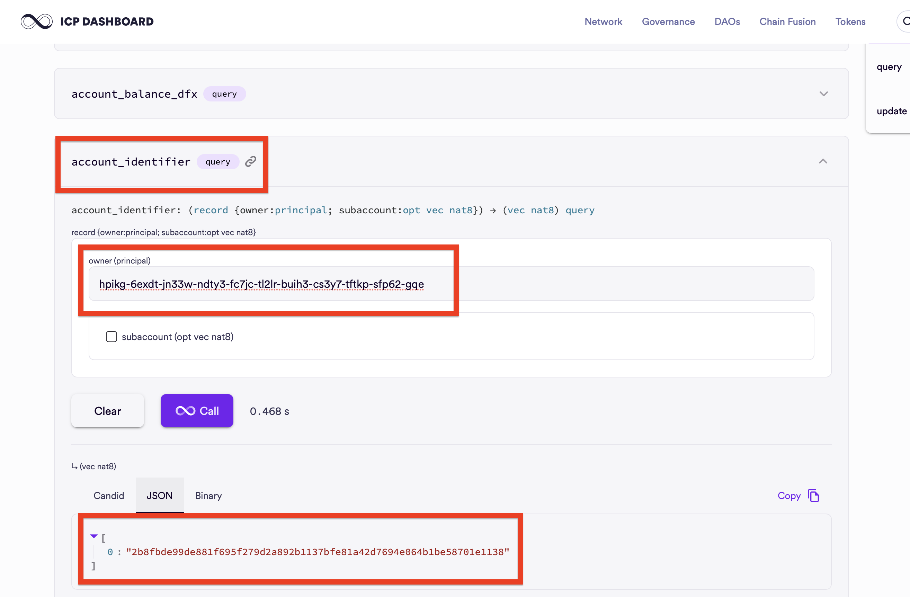
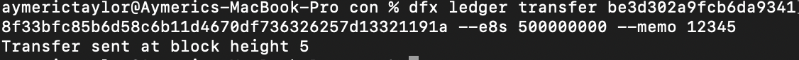
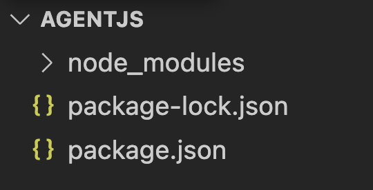
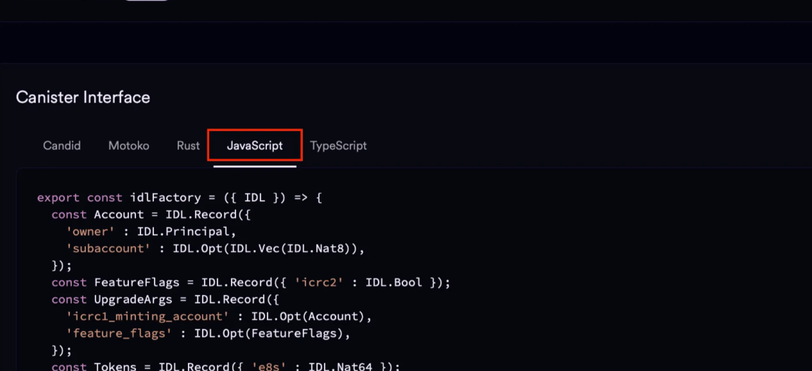

# System Canisters (NNS) and The ICP Token

In this tutorial, we’ll simulate `ICP` tokens on our local IC replica and transfer them using both the `dfx` CLI and the ICP JavaScript Agent.

The network’s native token, `ICP`, is implemented similarly to an ERC-20 token. Balances and transfers are managed by a system canister called the **ICP Ledger**. This ledger is part of the Network Nervous System (NNS), a set of core system canisters built into the protocol.

On both local the IC instance and mainnet, the ICP Ledger has the same canister ID: `ryjl3-tyaaa-aaaaa-aaaba-cai`.

By default, a local replica doesn’t start with the NNS. So to test `ICP` token transfers locally, we need to start dfx with the NNS enabled.

## Set up the NNS Locally

To initialize our local IC instance with the NNS system canisters, add the `—system-canister` flag to our `dfx start` command. 

```bash
 dfx start --system-canisters --clean --background
```

- The `--clean` flag clears any existing local state before starting (fresh local replica).
- The `--background` flag runs the local replica in the background so your terminal is free for other commands.

Within the localnet, the anonymous principal is automatically minted with **1 Billion** ICP Tokens. (At time of writing 1 ICP = $3.23. So 1 billion ICP equals 3.23 billion dollars).

On the mainnet however, you would need to initially get `ICP` from a CEX or a friend.

## The Anonymous Principal is minted with 1 Billion ICP Tokens

To start sending ICP tokens out, we’ll first need to tell dfx to use the anonymous identity.

### Switch dfx Identities to the anonymous principal

The command below tells dfx to use anonymous identity. Which just means that the transaction is unsigned (no public/private key pair).

```jsx
dfx identity use anonymous
```

The `dfx identity use <identity_name>` command is used to alter between identities saved in dfx. You can see the list of identities that dfx saves using the `dfx identity list` command.

Confirm that you are using the anonymous principal. Unsigned transactions are identified by the principal:  `2vxsx-fae`.

```jsx
dfx identity get-principal
```


### Check anonymous’ ICP Balance

To check the balance of the `anonymous` identity, run

```bash
dfx ledger balance
```


## ICP Ledger `Transfer()` function

To transfer ICP Tokens, we would be calling the `transfer()` function of the ICP Ledger Canister. It takes the following required arguments:

| Field | Type | Explanation |
| --- | --- | --- |
| `To` | `account_identifier` | The recipient’s **Account Identifier**. |
| `Amount` | `u64` | Amount to transfer in **e8s** (smallest ICP unit). `100_000_000 e8s = 1 ICP`. |
| `Fee` | `u64` | Fixed ledger transaction fee in **e8s**: `10_000 e8s` (`0.0001 ICP`). 

Paid by the sender **in addition** to `Amount`. |
| `Memo` | `u64` | An arbitrary user defined `u64` number. 

Used as the unique identifier of the transaction to prevent transaction deduplication. |

ICP transfers are directed to **account identifiers**, not principals.

### Transfers are directed to `Account Identifiers`

To save memory, the ICP Ledger hashes Principals into a **32-byte hash** called the `account identifier`, reducing storage requirements by ~50%.

The general formula for computing the account_id from the principal is

```
accountId = hash(principal, subaccount)
```

Here, the `subaccount` acts like a salt. By changing the `subaccount` value, you derive different account IDs that are all tied to the same principal that is still under your control

```
accountId1 = hash(principal, null)
accountId2 = hash(principal, 2)
```

We can query the default account identifier for genesis (`null` value for subaccount) using dfx

```bash
dfx ledger account-id
```


**anonymous** would have the default account identifier of: `1c7a48ba6a562aa9eaa2481a9049cdf0433b9738c992d698c31d8abf89cadc79`

Optionally, you could also compute for the `account_id` of a principal through calling the [`account_identifier()` function](https://dashboard.internetcomputer.org/canister/ryjl3-tyaaa-aaaaa-aaaba-cai) on NNS ICP Ledger dashboard. `dfx` abstracts this function call for you.



## Transfer `ICP` through dfx

We’ll transfer 5 ICP from anonymous to a random identity. Let’s call him `Bob`.

`Bob` has a user **principal** of:

- `ncgnw-oidst-l5kdp-3go53-cegtn-aql23-ync6p-himc7-gm6w7-3s2tw-xae`.

His default **account-id** would be:

- `5dbfde09991c7a6d3f5208df7328e7ea54109ee3b63fcc4bc1e44de020ec2b8a`.

The default **Fee** is fixed at **10_000** `e8s` and we’ll set the **memo** to **12345**.

In summary the transfer to Bob would have the following parameters:

- `To` : `ncgnw-oidst-l5kdp-3go53-cegtn-aql23-ync6p-himc7-gm6w7-3s2tw-xae`
- `Amount` : `500_000_000`
- `Fee` : `10_000`
- `memo` : `12345`

Using dfx’s built in ledger transfer function,

```bash
dfx ledger transfer <recipient's account identifer> --icp <ICP amount> --memo <arbitrary number>
```

Replace the details from above.

```bash
dfx ledger transfer be3d302a9fcb6da93418f33bfc85b6d58c6b11d4670df736326257d13321191a --e8s 500000000 --memo 12345
```

A successful output should indicate the block which your transaction proof is stored at.



## Transfer ICP using ICP Javascript Agent

Install the necessary dependencies to use the `Agent JS`.  Since the anonymous account is an unsigned transaction, we do not have to import a private key.

1. Create a new folder called `AgentJs`. In that folder directory, run the following commands: 
    
    ```rust
    npm init -y
    npm i --save @dfinity/agent
    npm i @dfinity/identity-secp256k1 
    ```
    
    Your folder directory should look like this:
    
    
    
2. Create a new file called `idlFactory.js` and paste the JavaScript representation of the ICP Ledger’s Candid interface into it. This Candid interface can be found at the bottom of t[he ICP Ledger canister page](https://dashboard.internetcomputer.org/canister/ryjl3-tyaaa-aaaaa-aaaba-cai).

The Candid interface serves the same purpose as a **contract ABI in Ethereum**. It describes all the methods exposed by the canister along with their input and output types, allowing the JavaScript Agent to correctly encode requests and decode responses when interacting with the ICP Ledger.
    
    
    
    Your folder should look similar to this:
    
    
    
3. Within the 📁AgentJS folder, create a new file called `agentScript.js` and import the modules:
    
    ```jsx
    import { Secp256k1KeyIdentity } from '@dfinity/identity-secp256k1';
    import { HttpAgent, Actor } from "@dfinity/agent";
    import { Principal } from "@dfinity/principal";
    import { idlFactory } from "./idlFactory.js";
    import fs from 'fs';
    ```
    

From now on, the following codes will be added to `agentScript.js` 

1. Create an **agent** instance. (This is similar to creating a “wallet” instance in Ethers.js.)
    
    ```jsx
    // Imported Libraries...
    
    // Create agent
    const agent = await HttpAgent.create({
      host: "http://127.0.0.1:4943", // connect to the local host
      fetch,
    });
    await agent.fetchRootKey();
    console.log("🌐 Agent ready.");
    ```
    
2. Declare the ICP Ledger Canister instance, or in ICP terms, `Actor`. Canister instances are referred to as `Actors` in ICP:
    
    ```jsx
    // previous code...
    
    // Ledger canister ID and actor creation
    const ledgerCanisterId = "ryjl3-tyaaa-aaaaa-aaaba-cai";
    const actor = Actor.createActor(idlFactory, {
      agent,
      canisterId: ledgerCanisterId,
    });
    console.log("📦 Actor created.");
    ```
    

1. **Build** the transaction data:
    
    ```jsx
    // previous code...
    
    // Target Receiver Principal
    const receiverPrincipalStr = "jvjbz-wuejr-a6thn-gkzt4-ybkfq-slmbo-2w3ku-kgnjf-pg6x7-xxfqs-vae";
    const ReceiverPrincipal = Principal.fromText(receiverPrincipalStr);
    const account = { owner: ReceiverPrincipal, subaccount: [] };
    
    const accountId = await actor.account_identifier(account);
    console.log("🔑 Resolved accountId:", accountId);
    
    // Prepare transfer
    const TransferArgs = {
      to: accountId,
      fee: { e8s: BigInt(10_000) },
      memo: BigInt(0),
      from_subaccount: [],
      created_at_time: [],
      amount: { e8s: BigInt(1_00_000_000) },
    };
    ```
    
2. **Sign** and **Send** the transaction:
With the transfer arguments prepared, we can now submit the transaction to the ICP Ledger canister. The Agent handles request signing (or leaves it unsigned for anonymous calls) and sends the message to the network.

Add the following code to `agentScript.js`:
    
    ```jsx
    // previous code ...
    try {
        const result = await actor.transfer(TransferArgs);
        console.log("Transfer result:", result);
    } catch (error) {
        console.error("Error :", error);
    }
    ```
    

Now run the script from the AgentJS directory:

```rust
node agentScript.js
```

If the transaction is successful, the Ledger returns a `Result` type containing the **block index** where the transfer was recorded. For example:


The value `15n` represents the **ledger block height** that contains your transaction. Every ICP transfer is immutably recorded in a block, and this index can be used to independently verify the transaction.

## **Verify the ICP Token Transaction**

Every successful ICP transfer is permanently recorded by the **ICP Ledger canister**. When a transfer completes, the Ledger returns the **block index** where the transaction was stored. This block index acts as a verifiable receipt for the transaction.

In the previous step, our transfer returned:

`Ok: 15n`

This tells us that the transaction was included in **block 15** of the ledger. We can now independently verify the transfer by querying this block directly from the Ledger.

Note: The exact block index may vary between runs. Depending on prior transactions in your local replica, you might see values like Ok: 3n, Ok: 5n, or any other block number. What matters is that the value represents the **ledger block index** where your transaction was recorded.

The ICP Ledger exposes a `query_blocks` method that allows us to fetch ledger entries by block range. To retrieve the block containing our transaction, run:

```bash
dfx canister call ryjl3-tyaaa-aaaaa-aaaba-cai query_blocks '(record { start = 15 : nat64; length = 1 : nat64 })'
```

**Note**: change the block number in `start = NUMBER` to the block number that you obtained.

A successful response will include the full transaction record stored in that block.


We can perform the same verification programmatically using the JavaScript Agent. This is useful when building applications that need to track or confirm transactions without relying on the CLI.

Add the following code to `agentScript.js`:

```rust
const blockHeight = BigInt(5);
const block = await actor.block(blockHeight);
console.log("Block at height 5:", block);
```

This queries the Ledger for the exact block that contains our transfer.


Your transaction details are recorded at the canister, including timestamp, sender, recipient, amount, memo, and fees.

The result confirms:

- Our unique memo: `12345`
- The Recipient: `5dbfde09991c7a6d3f5208df7328e7ea54109ee3b63fcc4bc1e44de020ec2b8a`
- The amount sent: `500_000_000 e8s` = `5 ICP`
- The memo: `12345`
- The block index: `5`

This matches the earlier command:

```bash
dfx ledger transfer ae6e1a76da5725bbbf0c5c035aaf0525b791e0f0f7cce27d8e27826389871406 --icp 5 --memo 12345
```

**Note**: The blocks that are queried are information that is stored on the canister-level since the protocol doesn’t have an Solidity event-like functionality.

`ICP` tokens are used for protocol-level governance voting, store of value and rewarding validators. However, they are not used for paying gas fees, another native token, `Cycles`, is used instead. The next article discusses the gas model and `Cycles` token of the Internet Computer Protocol.