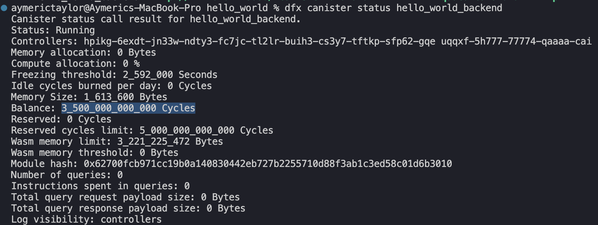
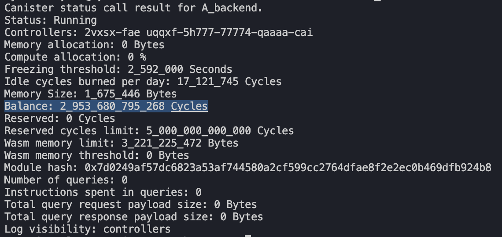
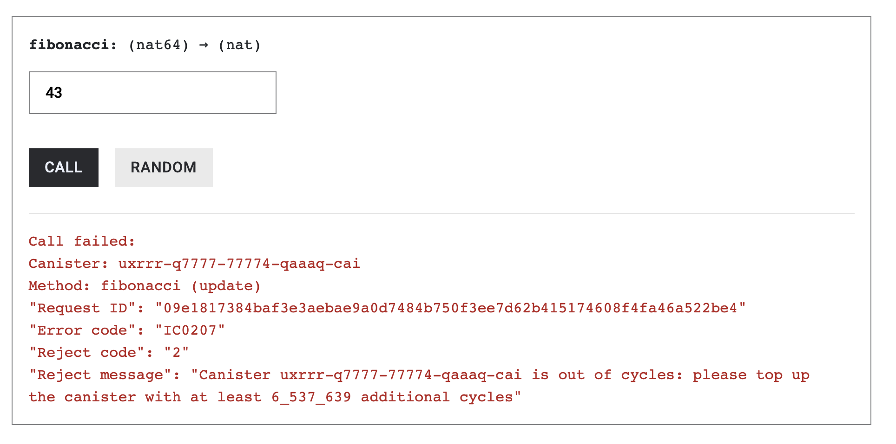
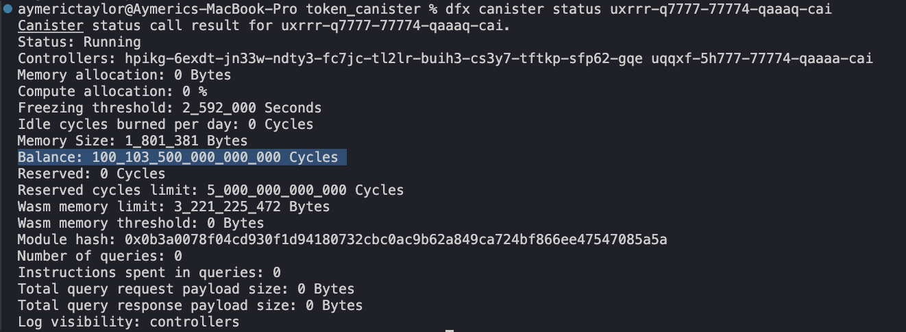

# The Reverse Gas Model of ICP

In this article, we will discuss the gas model of the Internet Computer Protocol and why it allows unsigned transactions to be treated as valid transactions at the protocol level.

In blockchains like Ethereum and Solana, transaction validity is tightly coupled to **who pays for gas**. When a user submits a transaction, the network must verify the sender’s identity and ensure that the sender has sufficient balance to pay for the execution. If these conditions are not met, the transaction is rejected before any smart contract logic runs.

This model enforces a strict rule: only **funded** and **signed accounts** can submit valid transactions. As a result, unsigned transactions and transactions from accounts without gas are rejected by default.

The **Internet Computer Protocol** takes a fundamentally different approach. Instead of charging users for computation, the network always charges the **called canister**.

## Canisters Pay For Gas Fees

When a user invokes a canister function, the full cost of execution is charged to the **called canister**, not to the user. This design is known as the **reverse gas model**.

From the user’s perspective, the transaction appears free. Behind the scenes however, the canister pays for the computation.

Because gas fees are always charged to the canister, transaction execution no longer depends on the caller’s balance or ability to pay.

### The network accepts unsigned transactions

Since users are not responsible for paying gas fees, the network does not require a user’s signature in order to process a transaction. As a result, the Internet Computer can accept **unsigned transactions**, which are identified by the anonymous principal: 2vxsx-fae.

From the protocol’s point of view, the caller’s identity is irrelevant for billing purposes—the network already knows exactly where to charge the gas fees: the called canister.

The caller’s identity only becomes relevant **inside the canister’s own logic**. If a canister needs to enforce authorization, prevent spam, or track ownership, it can explicitly inspect the caller using `msg.caller()` and reject calls originating from the anonymous principal. In other words, support for unsigned transactions is enabled by the protocol, but access control remains fully programmable at the application level.

## ICP’s Gas Token: `Cycles`

**Gas fees on the Internet Computer are not paid in `ICP` tokens**. Instead, the Internet Computer uses a special utility token called `Cycles`, which is used to pay for gas fees and storage.

 

Canisters pay for gas fees with the `Cycles` token. All canisters have a Cycles reserve to pay for gas fees which is tracked natively by the protocol.

We can verify for ourself that a canister has a `Cycles` balance with the following dfx command:

```jsx
dfx canister status <Canister-ID>
```

Deploy any canister locally. You’ll see a **Balance** section showing the amount of Cycles the canister has, which is typically around 3.5 trillion Cycles.



Each time a user calls one of the canister’s functions, the network deducts the gas fee from the canister’s Cycles balance.

Lets see for ourselves that when we call a function, the canister’s Cycles balance decreases due to the network deducting gas fees from it.

## Running Canister Functions Consume `Cycles`

To see ICP’s reverse gas model in action, we’ll deploy a simple canister and observe how its **Cycles balance decreases** when an expensive update function is executed.

We’ll use a deliberately inefficient recursive `fibonacci()` function, which consumes a significant amount of computation—and therefore Cycles.

To achieve this, start by creating a new project using dfx:

```rust
dfx new icp_gas_model --type rust --no-frontend
cd icp_gas_model
```

Open [lib.rs](http://lib.rs/) file and replace it with the following code:

```rust
use ic_cdk::update;

#[update]
fn fibonacci(n: u64) -> u64 {
    if n <= 1 { n as u64 } else { fibonacci(n - 1) + fibonacci(n - 2) }
}

ic_cdk::export_candid!();
```

The above implementation of `fibonacci()` is intentionally inefficient:

• It uses **naive recursion**
• Each call spawns two more calls
• The total number of function calls grows exponentially with n

Because this is an **update function**, every recursive call consumes computation that must be paid for with **Cycles**. This makes it ideal for demonstrating Cycles consumption.

Next, generate the Candid interface by running the following command:

```rust
generate-did icp_gas_model_backend
```

Start the local Internet Computer replica by running the following command:

```rust
dfx start --system-canisters --clean --background
```

Deploy the canister to the local replica by running the following command:

```rust
dfx deploy
```

Inspect the canister’s Cycles balance using:

```rust
dfx canister status icp_gas_model_backend
```

In the output, look for the **Balance** field:


Now invoke the `fibonacci()` function **once**, passing `43` as the argument:

```rust
dfx canister call icp_gas_model_backend fibonacci 43
```

This call triggers a large number of recursive executions and consumes a significant amount of computation.

After the call completes, check the canister’s Cycles balance again:

```rust
dfx canister status icp_gas_model_backend
```

You should observe that the **Cycles Balance has decreased substantially** compared to the initial value.



The user called the function, but the called canister paid for it in `Cycles`.

In traditional blockchains, users without gas tokens cannot call smart contracts. In ICP, if the canister do not have enough `Cycles`, it cannot run function calls from users. Next, we’ll discuss the implications of a canister without enough Cycles to run its own functions.

### Low Cycles Balance Implication

When a canister runs out of Cycles, it stops executing update functions since it cannot pay for the gas fees.

Try running `fibonacci(43)` 6 more times to exhaust the canister’s Cycles balance. This operation will consume about 3 trillion cycles (500 billion * 6). At the 6th time, `fibonacci(43)` will respond with an error: “canister is out of cycles”.



The call fails because the cost to run the function exceeds the amount of Cycles our canister has. We can’t run the function since the canister cannot pay for the computation cost.

Query functions however, does not consume cycles as it does not go through consensus and directly queries a node.

If we’re in a situation where our canister is out of Cycles, we’ll need to send more Cycles to the canister to allow it to service function calls. The next section discusses how Cycles are created and how we can top-up our canister with more Cycles.

## Cycles Origin

`Cycles` are created from converting `ICP` tokens into `Cycles` token — this is a one way conversion. The *Cycles Minting Canister* (also an NNS system canister) facilitates this conversion— Users send `ICP` in, and receives `Cycles`, the gas token back.

### Convert `ICP` token into `Cycles` token

We can use the following dfx command to convert ICP tokens to Cycles tokens.

```jsx
dfx cycles convert --amount <AMOUNT>
```

 

Replace `<AMOUNT>` with **10** and it would convert about it to 35 Trillion Cycles.

```jsx
dfx cycles convert --amount 10
```


We have converted 10 ICP tokens into 17 Trillion Cycles, which we can send it to our canister that’s low on Cycles.

### The converted `Cycles` are tracked by the Cycles Ledger

The Cycles that a user gets from converting it from ICP is tracked on the *Cycles Ledger*, a system canister.

Like the ICP Ledger, which tracks the amount of ICP we have, the Cycles Ledger tracks the amount of Cycles we have. Across the mainnet and localnet they have the same Canister ID: `um5iw-rqaaa-aaaaq-qaaba-cai`.

We can use these Cycles to deploy a canister or send it to our canister that’s low on Cycles balance.

## Top up a canister with  Cycles

The command below sends our Cycles from the Cycles Ledger to our canister of choice.

```jsx
dfx cycles top-up <To> <Amount>
```

Replace 

- `<TO>` with the fibonacci canister: `uxrrr-q7777-77774-qaaaq-cai`
- `<AMOUNT>` with the amount of Cycles we converted, 17 Trillion Cycles: `17T`

```jsx
dfx cycles top-up uxrrr-q7777-77774-qaaaq-cai 17T
```


Verify the increase in Cycles balance with the command below.

```jsx
dfx canister status <Canister-ID>
```

**Before**: The fibonacci canister has less than 500 Billion Cycles


**After**: The fibonacci canister has about 100 quadrillion Cycles



The Internet Computer Protocol adopts the reverse gas model, where canisters pay for all the computation cost. The Cycles token is used as the gas token and to obtain it, we convert it from ICP tokens. 

In the next article, we’ll discuss ICP’s storage rent model, where canisters pay for on-chain on a recurring basis with Cycles.