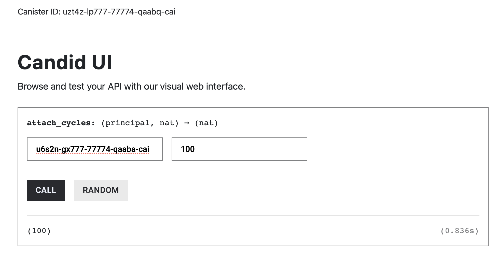
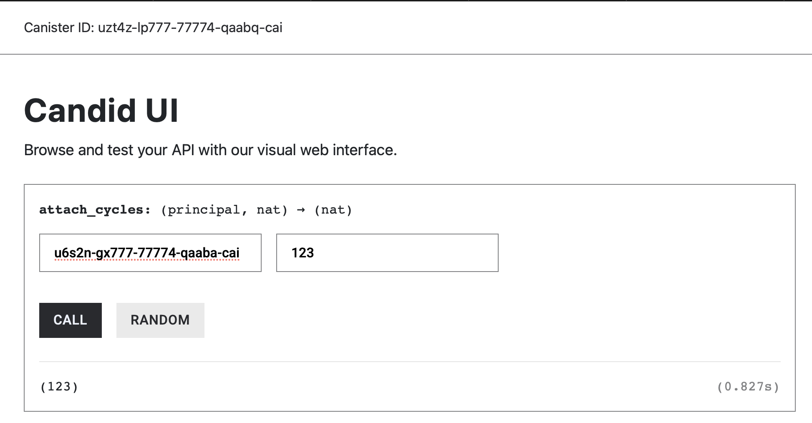

# Transfer Cycles Between Canisters

Cycles can be sent directly from one canister to another as part of an inter-canister call using the `.with_cycles()` method. 

A canister might require that you attach cycles to cover their execution cost or to add economic disincentive towards malicious actors draining the canister’s cycles.

### `.with_cycles()` sends Cycles to the Called Canister

The `.with_cycles(amount)` method allows a canister to attach cycles to an inter-canister call. When the call is made, amount cycles are deducted from the caller canister’s balance and included in the outgoing call message sent to the callee. 

Attaching cycles alone does not guarantee that the callee will receive them; the receiving function must explicitly accept the cycles during execution.

The example below defines a function named `attach_cycles()` that takes a `Principal` identifying the target canister as input. The function initiates an inter-canister call to the callee’s `receive()` method, attaches a user-defined amount of cycles using `.with_cycles(amount)`, and then awaits the result of the call.

```rust
#[ic_cdk::update]
async fn attach_cycles(_callee: Principal){

		// attach cycles
		let result = Call::unbounded_wait(_callee , "receive")
												.with_cycles(amount)
												.await
}
```

This is analogous to Solidity’s low-level `.call` with `value`:

```solidity
function attachEtherRaw(address payable callee) external payable {
    (bool ok, ) = callee.call{value: msg.value}(
        abi.encodeWithSignature("acceptEther()")
    );
    require(ok, "call failed");
}
```

Attaching cycles to an inter-canister call is not enough by itself. The receiving canister function must explicitly accept those Cycles; otherwise, the Cycles are refunded to the caller.

### Receive Cycles with `msg_cycles_accept()`

For another canister to receive cycles through an inter-canister call, the canister must have a function that explicitly accepts the attached cycles by calling `msg_cycles_accept()` from **system API** during execution.

```rust
use ic_cdk::api::{msg_cycles_accept};

#[ic_cdk::update]
fn receive() -> u128 {
		ic_cdk::api::msg_cycles_accept(//u128 number)
}
```

This is similar to declaring a function as payable in Solidity, which allows it to receive Ether sent with a call.

The `msg_cycles_accept()` function takes an input of type u128 that specifies the maximum number of cycles the canister is willing to accept from the incoming call. It returns the actual number of cycles that were accepted.

To accept all cycles attached to the inter-canister call, we use the System API `msg_cycles_available()` as shown below, which tells us how many Cycles are attached:

```rust
use ic_cdk::api::{msg_cycles_accept, msg_cycles_available};

#[ic_cdk::update]
fn receive() -> u128 {
msg_cycles_accept(msg_cycles_available())
}

ic_cdk::export_candid!();
```

If the receiving function doesn’t implement `msg_cycles_accept`, it would not accept the cycles.

### Simple POC of Sending Cycles

To put everything we have learned into practice, consider two canisters: **canister A** (the caller) and **canister B** (the callee)  shown below.

`canister A`

```rust
use candid::Principal;
use ic_cdk::call::Call;
use ic_cdk::update;

#[update]
async fn attach_cycles(_callee: Principal, amount: u128) {
let raw_result = Call::unbounded_wait(_callee , "receive")
.with_cycles(amount)
.await;

let decoded_result = raw_result.unwrap().candid::<u64>();
decoded_result.unwrap()
}

ic_cdk::export_candid!();
```

`canister B`

```rust
use ic_cdk::api::{msg_cycles_accept, msg_cycles_available};

#[ic_cdk::update]
fn receive() -> u128 {
msg_cycles_accept(msg_cycles_available())
}

ic_cdk::export_candid!();

```

Canister A explicitly defines a function named `send_cycles()` that initiates an inter-canister call and attaches cycles to the request, while canister B defines a function named `receive()` that explicitly accepts those cycles during execution.

First, deploy the callee canister (canister B), which exposes a function capable of accepting cycles. After deployment, record the initial cycles balance of canister B by running:

```rust
dfx canister status <canister_b_id>
```

Next, deploy the caller canister (canister A) and record its initial cycles balance using:

```rust
dfx canister status <canister_a_id>
```

Then, invoke the `send_cycles()` function on canister A, specifying canister B as the callee and attaching a chosen amount of cycles.



After the call completes, check the cycles balance of both canisters again using the same `dfx canister status` command. You should observe that canister B’s cycles balance has increased by the number of cycles it accepted, while canister A’s balance has decreased by the same amount (excluding execution costs). This confirms that cycles were successfully transferred during the inter-canister call.

### What happens if receiver does not implement `msg_cycles_available()`?

So far, we have seen what happens when the callee **explicitly accepts** the cycles attached to an inter-canister call: the cycles are transferred from the caller to the callee, and both canisters’ balances update accordingly.

But what if the receiving canister **does not accept** the attached cycles?

To answer this question, let’s slightly modify the previous example by removing the call to `msg_cycles_accept()` from the callee’s function

```rust
use ic_cdk::api::{msg_cycles_accept, msg_cycles_available};

#[ic_cdk::update]
fn receive() -> u128 {
    msg_cycles_available() // new code here
}

ic_cdk::export_candid!();
```

In the caller canister, return the value of `msg_cycles_refunded()`. This system API function reports how many cycles were refunded to the caller after the inter-canister call completes.

`Caller`

```rust
use candid::Principal;
use ic_cdk::call::Call;
use ic_cdk::api::msg_cycles_refunded;

#[ic_cdk::update]
async fn attach_cycles(_callee: Principal, amount: u128) -> u128 {
    let raw_result = Call::unbounded_wait(_callee, "receive()").with_cycles(amount).await;
		// we did not parse the data as we only want to see the amount of cycles refunded
    msg_cycles_refunded()
}

ic_cdk::export_candid!();
```

Re-deploy the callee canister and call `attach_cycles` from the caller canister.



We can see that the cycles was fully refunded because the called canister function does not implement `msg_cycles_accept()`.

To send cycles, use the `.with_cycles` along with the inter-canister call. The receiving function needs to implement `msg_cycles_accept(amount)` or it will not accept the cycles.

## Handling Cycles Drainage with a Minimum Fee

So far, we have focused on the mechanics of attaching, accepting, and refunding cycles in inter-canister calls. While this behavior is useful on its own, it becomes especially important when thinking about **canister security and cost control**.

Because canisters pay for execution in cycles, a poorly designed interface can allow callers to trigger expensive computation without contributing to its cost. Over time, this can drain a canister’s cycles balance or even make denial-of-service attacks economically viable.

A common defense against this problem is to **require callers to attach cycles as a fee**. The canister then explicitly accepts only the amount it wants to charge, while any excess cycles are automatically refunded by the protocol. Let’s look at how to implement this pattern.

### **Charging a Minimum Fee**

In this pattern, callers must attach **at least `MIN_FEE` cycles** when invoking the function. The canister accepts exactly `MIN_FEE` cycles and rejects calls that attach less. Any cycles attached above the minimum are automatically refunded.

```rust
use ic_cdk::api::call::{msg_cycles_available, msg_cycles_accept};

const MIN_FEE: u128 = 10_000_000_000_000; // e.g. 10T cycles, adjust to your needs

#[ic_cdk::update]
fn expensive_with_min_fee() {
    // 1. How many cycles did the caller attach?
    let available = msg_cycles_available128();

    if available < MIN_FEE {
        ic_cdk::trap("Not enough cycles attached for this call");
    }

    // 2. Accept only the minimum fee we want to keep
    let accepted = msg_cycles_accept128(MIN_FEE);
    assert_eq!(accepted, MIN_FEE);

    // do work
}

```

**What’s Happening**

- The caller must attach **at least `MIN_FEE` cycles**.
- The canister explicitly accepts only `MIN_FEE`, which becomes the execution fee.
- Any additional cycles are **automatically refunded** to the caller at the end of the call.

This creates a **hard economic barrier**: repeatedly calling this function requires paying real cycles, making abuse and spam economically costly.