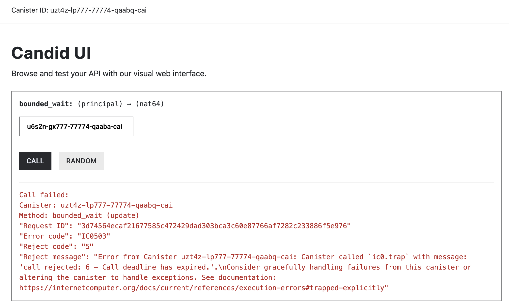

# unbounded_wait() vs bounded_wait()

**Some functions can execute in milliseconds, while others may take several seconds or longer**. This usually depends on how much computation the function performs.

When one canister calls another, the calling canister does not actively wait for the result. Instead, as soon as it reaches an await, the Internet Computer pauses that function’s execution. 

While this paused call is waiting, the canister itself is still active and can continue handling other incoming requests. Once the response comes back—or a timeout is reached—the paused function resumes exactly where it left off.

In this article, we’ll use a slow, computation-heavy function to see how this waiting behavior works in practice. We’ll then compare `Call::unbounded_wait()` and `Call::bounded_wait()` to understand how long a caller should wait for a response and how this choice affects responsiveness and user experience.

## A Case of Computationally Expensive Function

To make this behavior concrete, let’s start with a canister method that takes a noticeable amount of time to execute. The following function performs a large amount of computation by looping billions of times before returning a result.

Because of the amount of work it performs, this function takes several seconds to complete, making it a good example for observing how inter-canister calls behave when responses are slow.

```rust
#[ic_cdk::update]
fn loop_block() -> u64 {
    let limit: u64 = 3_900_000_000; 
    let mut total: u64 = 0;

    for i in 0..limit {
        // Do something simple but not optimizable to a no-op
        total = total.wrapping_add(i ^ (i >> 3));
    }

    total
}

ic_cdk::export_candid!();
```

If you invoke this function directly—for example, from the Candid UI—you’ll notice that it takes several seconds to return a response. On most machines, this call typically completes in around 12–14 seconds.

This delay makes `loop_block()` a useful test case for understanding what happens when one canister calls another and has to wait for a response.


### **How unbounded_wait() Affects Execution Time**

Now that we have a function that takes a noticeable amount of time to complete, let’s see what happens when it is called from another canister. 

```rust
use candid::Principal;
use ic_cdk::call::Call;

#[ic_cdk::update]
async fn call_loop_block(canister_b: Principal) -> u64 {

    let result = Call::unbounded_wait(canister_b, "loop_block").with_args(&(1 as u64,)).await;
    
    if result.is_ok() == false{
		    ic_cdk::trap("The inter-canister call failed");
    }
    
    let decoded_value = result.unwrap().candid::<u64>();
    
    if decoded_value.is_ok() == false {
		    ic_cdk::trap("Failed to decode data");
		}
    
    decoded_value.unwrap()
}

ic_cdk::export_candid!();
```

In the example above, the **caller canister** invokes the `loop_block()` method defined in the **callee canister** using `Call::unbounded_wait()`. 

This means the caller is willing to wait for the response for as long as it takes.

As a result, the `call_loop_block()` method in caller canister does not complete until the callee finishes executing `loop_block()`, causing the overall call to take roughly 15 seconds.


One limitation of using `Call::unbounded_wait()` is that the caller has no upper bound on how long it is willing to wait for a response. If the **callee canister** delays its reply—whether due to heavy computation, a stalled execution, or a failure to route the response—the function call from **caller canister** will take long time to respond or it would never respond.

With `Call::unbounded_wait()`, the caller explicitly agrees to wait indefinitely for a reply. As a result, the original request may take an unacceptably long time to complete from the caller’s perspective.

In many cases, such unbounded waiting leads to poor user experience. To address this, the Internet Computer allows callers to enforce an upper limit on how long they are willing to wait for a response by using the `Call::bounded_wait()` constructor, which introduces a configurable timeout for inter-canister calls.

## **Limiting How Long a Caller Waits with `Call::bounded_wait()`**

In many situations, waiting indefinitely for a response is undesirable. To prevent this, the Internet Computer allows a caller canister to specify **how long it is willing to wait** for a reply by using `Call::bounded_wait()`.

By default, `Call::bounded_wait()` waits up to **300 seconds** for a response from the callee canister. If no reply is received within this time, the call is aborted and returns a **`Call Deadline Expired`** error.

To see this behavior in action, let’s configure a much shorter timeout. In the example below, the caller sets a timeout of **5 seconds**. Because the `loop_block()` method takes significantly longer to complete, the caller will stop waiting before the response arrives.

```rust
use candid::Principal;
use ic_cdk::call::Call;

#[ic_cdk::update]
async fn b(canister_b: Principal) -> u64 {
    let result = Call::bounded_wait(canister_b, "loop_block")
        .change_timeout(5)
        .await;

    if result.is_err() {
        ic_cdk::api::trap(result.unwrap_err().to_string());
    }

    let decoded_result = result.unwrap().candid::<u64>();
    decoded_result.unwrap()
}

ic_cdk::export_candid!();

```

When this function is called, it fails with a **Call Deadline Expired** error. This happens because the caller only waits 5 seconds for a response, while the callee takes over 13 seconds to finish executing.



We’ll get a “*Call deadline has expired error”*, although the canister finishes executing. Since we only give the inter-canister call 5 seconds to return a response but it takes 13 seconds at least to respond. 

It’s important to note that timing out the call does **not** stop the callee canister from executing its function. The caller simply stops waiting for the response. Meanwhile, the canister continues processing other queued messages and will only resume the paused execution if a reply arrives within the configured time limit. We’ll explore this execution model in more detail in the next article